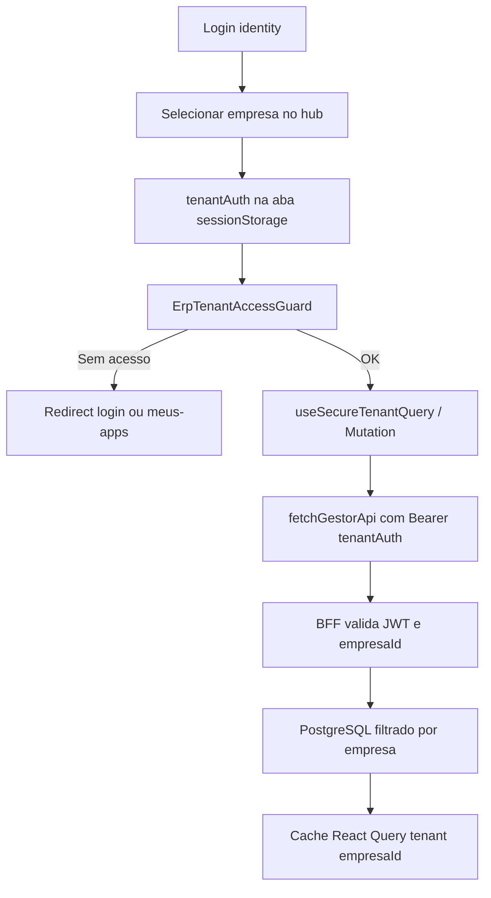

# Guia Oficial: Implementação Segura Multi-Tenant — Jiffy Gestor

## 1. Visão geral

Este documento define a arquitetura e os **padrões obrigatórios** para implementação segura de funcionalidades multi-tenant no **Jiffy Gestor**. O guia estabelece **5 camadas de segurança** que garantem isolamento de dados entre empresas (tenants), prevenindo vazamento de cache entre abas e uso de token incorreto no frontend.

O sistema multi-tenant permite que múltiplas empresas utilizem a mesma aplicação de forma isolada: cada aba do browser opera com o JWT da empresa escolhida (`tenantAuth`), e o cache do React Query é sempre prefixado com `empresaId`.

### Stack real do projeto

| Camada | Tecnologia |
|--------|------------|
| Frontend | Next.js (App Router), React Query, Zustand |
| Comunicação | `fetchGestorApi` → rotas `/api/*` (BFF) |
| Backend | **Backend próprio** (API Routes / BFF Next.js) |
| Banco | **PostgreSQL** (acesso exclusivo pelo backend) |

**Ressalva obrigatória:** o Jiffy **não usa Supabase** no frontend nem RLS do Supabase. O isolamento no servidor é responsabilidade do **backend próprio + PostgreSQL**, validando o JWT de empresa (`tenantAuth`) e filtrando por `empresaId` nas queries SQL. O frontend **nunca** consulta o banco diretamente.

---

## 2. Modelo de sessão

### 2.1 Dois tokens distintos

| Token | Onde vive | Escopo | Persistência |
|-------|-----------|--------|--------------|
| `identityAuth` | Hub / login | Identidade do usuário (lista de empresas) | `localStorage` (`auth-storage`) |
| `tenantAuth` | ERP da empresa | JWT da empresa desta aba | `sessionStorage` (por aba) |

O campo legado `auth` no store é compatibilidade: `tenantAuth ?? identityAuth`. **Nunca use `auth` em hooks ERP** — use somente `tenantAuth` via `useSecureTenantQuery` / `useSecureTenantMutation` ou o auto-inject de `fetchGestorApi`.

### 2.2 Isolamento por aba

Cada aba do browser pode estar em uma empresa diferente. O `tenantAuth` fica em `sessionStorage`, então:

- Aba A (Empresa X) não compartilha token com Aba B (Empresa Y)
- O cookie global `tenant-token` **não** deve ser a fonte de verdade no cliente; o BFF deve preferir o `Authorization: Bearer` enviado pelo frontend

### 2.3 Reidratação

O `authStore` (Zustand) reidrata:

1. `identityAuth` e `hubEmpresas` do `localStorage`
2. `tenantAuth` do `sessionStorage`
3. Seta `isRehydrated: true`

Hooks seguros **só executam** após `isRehydrated && isAuthenticated && token válido && empresaId presente`.

---

## 3. As 5 camadas de segurança (padrão obrigatório)

### Camada 1 — Zustand (`authStore`)

Estado global de autenticação: `identityAuth`, `tenantAuth`, `isAuthenticated`, `isRehydrated`, `hubEmpresas`.

Arquivo: `src/presentation/stores/authStore.ts`

### Camada 2 — SessionStorage (isolamento por aba)

`tenantAuth` restaurado por aba a partir de `sessionStorage`. Garante que duas abas não misturem JWT de empresas diferentes no estado do cliente.

### Camada 3 — Hooks seguros (pré-execução)

| Hook | Uso |
|------|-----|
| `useSecureTenantQuery` | Toda leitura de dados por empresa |
| `useSecureTenantInfiniteQuery` | Listagens com paginação infinita por empresa |
| `useSecureTenantMutation` | Toda escrita de dados por empresa |

Regras internas:

- Usar **somente** `tenantAuth?.getAccessToken()` (nunca `identityAuth` / `auth`)
- Bloquear se `!isRehydrated || !isAuthenticated || !token || !empresaId || tenantAuth.isExpired()`
- Injetar `{ token, empresaId }` no `queryFn` / `mutationFn`

Arquivos:

- `src/presentation/hooks/useSecureTenantQuery.ts`
- `src/presentation/hooks/useSecureTenantInfiniteQuery.ts`
- `src/presentation/hooks/useSecureTenantMutation.ts`

### Camada 4 — React Query (cache isolado)

Toda query key de dados ERP **deve** seguir:

```typescript
['tenant', empresaId, ...baseKey]
// exemplo: ['tenant', 'abc-123', 'vendas']
// exemplo: ['tenant', 'abc-123', 'dashboard', 'resumo', 'hoje']
```

Helpers:

- `useTenantQueryKey(baseKey)` — monta a key no componente
- `useTenantEmpresaId()` — extrai `empresaId` do JWT
- `buildTenantQueryKey(empresaId, baseKey)` — função pura (útil em `onMutate`)
- `useInvalidateTenantQueries()` — invalida com escopo correto: `invalidate(['vendas'])` → `['tenant', empresaId, 'vendas']`

Arquivos:

- `src/presentation/hooks/useTenantQueryKey.ts`
- `src/presentation/hooks/useInvalidateTenantQueries.ts`

### Camada 5 — Guard de acesso (layout / página)

| Componente / Hook | Escopo |
|-------------------|--------|
| `ErpTenantAccessGuard` | Todas as rotas sob `ErpAppShell` (ERP) |
| `useTenantAccessGuard` | Validação programática (`hasAccess`, `accessError`, `isLoading`) |
| `PainelContadorAcessoGuard` | Painel Contador + claim `acessoFiscal` (fora do shell ERP padrão) |

Comportamento do `ErpTenantAccessGuard`:

- Loading → `JiffyLoading`
- Sessão expirada → redirect `/login`
- Sem sessão de empresa (identidade ok) → redirect `/meus-apps`

Arquivos:

- `src/presentation/components/layouts/ErpTenantAccessGuard.tsx`
- `src/presentation/components/layouts/ErpAppShell.tsx`
- `src/presentation/hooks/useTenantAccessGuard.ts`

### Camada de servidor (fora do frontend, obrigatória no backend)

O frontend **não** substitui o isolamento no banco. O BFF deve:

1. Validar o JWT (`tenantAuth`) em toda rota `/api/*` protegida
2. Extrair `empresaId` do token
3. Filtrar **todas** as queries PostgreSQL por `empresa_id` / `empresaId` da sessão

O frontend nunca usa cliente de banco no browser.

---

## 4. `fetchGestorApi`

Wrapper obrigatório para chamadas ao BFF (`/api/*`).

Arquivo: `src/presentation/utils/fetchGestorApi.ts`

Comportamento:

1. Se o chamador **não** enviar `Authorization`, injeta `Bearer` de `tenantAuth` (token da aba)
2. Em **401**, tenta refresh do JWT da empresa, sincroniza o store e **repete uma vez**
3. Se o refresh falhar, dispara evento de sessão expirada (exceto em rotas públicas de auth)
4. Não tenta refresh em rotas como `/api/auth/login`, `/api/auth/refresh-token`, consultas públicas, etc.

```typescript
// Preferido: deixar o auto-inject (ou passar token do contexto seguro)
await fetchGestorApi('/api/produtos')

// Também válido: token explícito do useSecureTenantQuery / Mutation
await fetchGestorApi('/api/produtos', {
  headers: { Authorization: `Bearer ${token}` },
})
```

---

## 5. Templates obrigatórios

### 5.1 Query segura

```typescript
// CORRETO
const { data, isLoading } = useSecureTenantQuery(
  ['produtos'],
  ({ token }) =>
    fetchGestorApi('/api/produtos', {
      headers: { Authorization: `Bearer ${token}` },
    }).then(r => r.json()),
  { enabled: true, staleTime: 30_000 }
)

// INCORRETO — risco de token de identidade (hub) e cache sem escopo
const { auth } = useAuthStore()
const token = auth?.getAccessToken()
useQuery({
  queryKey: ['produtos'],
  queryFn: () => fetch('/api/produtos', { headers: { Authorization: `Bearer ${token}` } }),
})
```

### 5.2 Mutation segura

```typescript
// CORRETO
const createCliente = useSecureTenantMutation(
  async ({ token }, data: { nome: string }) => {
    const res = await fetchGestorApi('/api/clientes', {
      method: 'POST',
      headers: { Authorization: `Bearer ${token}` },
      body: JSON.stringify(data),
    })
    if (!res.ok) throw new Error('Erro ao criar cliente')
    return res.json()
  },
  {
    onSuccess: async () => {
      await invalidate(['clientes'])
    },
  }
)
```

### 5.3 Invalidação com escopo

```typescript
const invalidate = useInvalidateTenantQueries()

// CORRETO
await invalidate(['vendas'])
await invalidate(['venda', id])

// INCORRETO — invalida (ou não) cache de outra empresa / sem isolamento
queryClient.invalidateQueries({ queryKey: ['vendas'] })
```

### 5.4 Página protegida pelo shell ERP

Rotas sob `ErpAppShell` **já** passam por `ErpTenantAccessGuard`. Não é necessário repetir `useTenantAccessGuard` em cada página, salvo regras extras (ex.: claim fiscal no Painel Contador).

```typescript
// Página ERP típica — acesso já garantido pelo shell
export function MinhaPage() {
  const { data, isLoading } = useSecureTenantQuery(
    ['meus-dados'],
    ({ token }) =>
      fetchGestorApi('/api/meus-dados', {
        headers: { Authorization: `Bearer ${token}` },
      }).then(r => r.json())
  )

  if (isLoading) return <JiffyLoading />
  return <div>{/* UI */}</div>
}
```

---

## 6. Checklist de implementação

Antes de entregar qualquer feature ERP:

- [ ] Usar `useSecureTenantQuery` para **todas** as consultas de dados por empresa
- [ ] Usar `useSecureTenantMutation` para **todas** as mutações de dados por empresa
- [ ] Invalidar cache com `useInvalidateTenantQueries` / `buildTenantQueryKey` (nunca key sem `tenant` + `empresaId`)
- [ ] Usar somente `tenantAuth` (nunca `auth` / `identityAuth` em hooks ERP)
- [ ] Chamar o BFF via `fetchGestorApi` (não `fetch` cru sem token da aba)
- [ ] Página sob `ErpAppShell` (ou guard específico se fora do shell)
- [ ] No backend: filtrar PostgreSQL por `empresaId` do JWT

### Validações críticas em toda query (frontend)

1. Sessão reidratada e autenticada
2. Token de empresa presente e não expirado
3. `empresaId` presente no JWT
4. Query key com prefixo `['tenant', empresaId, ...]`

### Validações críticas no backend (PostgreSQL)

1. JWT válido
2. `empresaId` extraído do token (não do body do cliente sem validação)
3. Toda query SQL filtrada por empresa da sessão

---

## 7. Erros críticos a evitar

1. **Query sem `empresaId` na key** — risco de cache bleed entre abas/empresas
2. **Usar `auth?.getAccessToken()` em vez de `tenantAuth`** — pode enviar token do hub
3. **Invalidação sem escopo** — `invalidateQueries({ queryKey: ['vendas'] })` sem prefixo tenant
4. **Mutation sem guard de sessão** — executar escrita sem validar `tenantAuth`
5. **Confiar só no frontend** — o BFF/PostgreSQL deve sempre filtrar por empresa
6. **Cliente de banco no browser** — proibido; apenas `/api/*`

---

## 8. Observabilidade (desenvolvimento)

| Ferramenta | Comportamento |
|------------|---------------|
| Warning em `useSecureTenantMutation` | Em `NODE_ENV === 'development'`, loga motivo do bloqueio de sessão |
| `useDetectCacheLeaks` | No `ErpAppShell`, alerta queries no cache sem prefixo `tenant` |

Arquivos:

- `src/presentation/hooks/useSecureTenantMutation.ts`
- `src/presentation/hooks/useDetectCacheLeaks.ts`

---

## 9. Status de conformidade

### Já alinhado ao padrão

| Área | Status |
|------|--------|
| Infra: `useSecureTenantQuery`, `useSecureTenantMutation`, `useSecureTenantInfiniteQuery`, `useInvalidateTenantQueries`, `useTenantQueryKey` | OK |
| CRUD cadastros (clientes, produtos, usuários, meios de pagamento, complementos, grupos, impressoras, perfis, NF-es) | OK |
| Listagens infinitas (`use*Infinite`) | OK |
| Mutations de vendas / patches de produto e grupo | OK |
| Morada telefone e delivery (mutations + keys) | OK |
| Dashboard (`useDashboard*Query`) | OK |
| Painel Contador (queries + mutations) | OK |
| Relatórios MVP, comissões, empresa/me, prefetch, WebSocket fiscal | OK (somente `tenantAuth`) |
| Delivery (`useDelivery`, Kanban pedidos delivery infinite) | OK (somente `tenantAuth` + keys `['tenant', empresaId, 'delivery', ...]`) |
| Kanban balcão (`vendas-unificadas` + por coluna) | OK — migrado para `useSecureTenantInfiniteQuery`; keys `['tenant', empresaId, 'vendas-unificadas', 'infinite', ...]` |
| Guard centralizado `ErpTenantAccessGuard` no `ErpAppShell` | OK |
| `fetchGestorApi` com auto-inject e retry 401 | OK |
| Testes unitários do núcleo (query, mutation, fetchGestorApi) | OK |
| Observabilidade dev (bloqueio de mutation + cache leak) | OK |
| Isolamento no BFF/PostgreSQL | OK (backend validado) |

### Gaps ainda abertos (registrar e priorizar)

| Gap | Camada | Notas |
|-----|--------|-------|
| Validação pós-resposta no frontend | Frontend | Filtrar itens de outro `empresaId` quando o payload trouxer o campo; hoje confiamos no BFF (defesa em profundidade opcional) |
| Logs de auditoria em produção | Frontend / Ops | Acesso a páginas, mutações, acesso negado (hoje só warnings em dev) |
| Métricas de segurança | Ops | Tentativas cross-tenant, queries sem escopo |

---

## 10. Arquivos críticos do projeto

| Arquivo | Papel |
|---------|-------|
| `src/presentation/stores/authStore.ts` | Sessão identity + tenant |
| `src/presentation/utils/fetchGestorApi.ts` | Fetch BFF com token da aba e refresh |
| `src/presentation/hooks/useSecureTenantQuery.ts` | Query segura |
| `src/presentation/hooks/useSecureTenantInfiniteQuery.ts` | Infinite query segura |
| `src/presentation/hooks/useSecureTenantMutation.ts` | Mutation segura |
| `src/presentation/hooks/useTenantQueryKey.ts` | `empresaId` + query keys |
| `src/presentation/hooks/useInvalidateTenantQueries.ts` | Invalidação escopada |
| `src/presentation/hooks/useTenantAccessGuard.ts` | Guard programático |
| `src/presentation/hooks/useDetectCacheLeaks.ts` | Detecção de cache sem prefixo (dev) |
| `src/presentation/components/layouts/ErpTenantAccessGuard.tsx` | Guard de layout ERP |
| `src/presentation/components/layouts/ErpAppShell.tsx` | Shell ERP + guard + leak detector |

Testes do núcleo:

- `tests/unit/presentation/hooks/useSecureTenantQuery.test.ts`
- `tests/unit/presentation/hooks/useSecureTenantMutation.test.ts`
- `tests/unit/presentation/hooks/fetchGestorApi.test.ts`

---

## 11. Fluxo principal



---

## Regra de ouro

**Se a query key não começa com `['tenant', empresaId, ...]`, não pode ser cache de dados ERP.**

**Se a mutation não passa por `useSecureTenantMutation` (ou guard equivalente de sessão de empresa), não pode escrever dados ERP.**

**Se o backend não filtra PostgreSQL pelo `empresaId` do JWT, o frontend sozinho não garante isolamento.**

Este guia deve ser seguido em todas as implementações multi-tenant do Jiffy Gestor.
