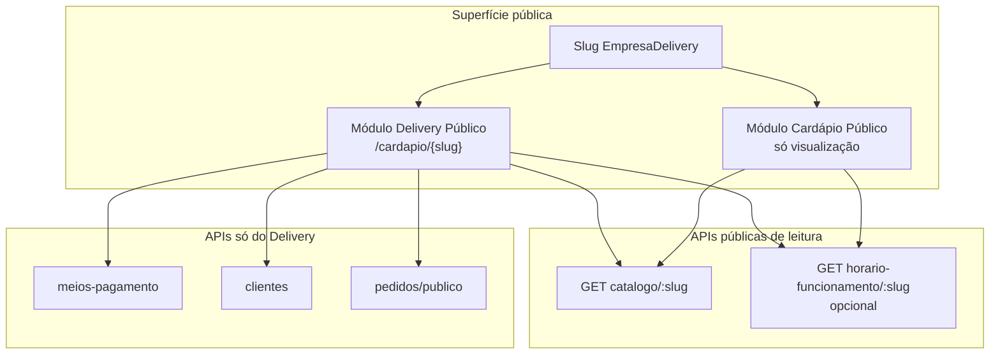

# Planejamento — Módulo Público: Cardápio (somente visualização)

> **Status:** planejamento (sem implementação)  
> **Data:** 2026-07-20  
> **Escopo deste doc:** viabilidade, arquitetura e decisões de URL — **não** inclui código.

---

## 1. Objetivo

Criar um **segundo módulo público**, separado do **Delivery Público**, cuja única função é **expor o cardápio de produtos** para o cliente visualizar.

| | Delivery Público (existente) | Cardápio Público (proposto) |
|--|------------------------------|-----------------------------|
| Objetivo | Cliente monta pedido e finaliza | Cliente **só vê** o cardápio |
| Carrinho / checkout | Sim | **Não** |
| Criação de pedido | Sim (`/pedidos/publico`) | **Não** |
| Cadastro/busca de cliente | Sim | **Não** |
| Meios de pagamento | Sim | **Não** (desnecessário) |
| Identificação da loja | Slug da empresa delivery | **Mesmo slug** |
| Fonte de produtos | Catálogo público | **Mesmo endpoint de catálogo** |

Tratar cada um como **módulo** distinto no frontend e no produto, mesmo compartilhando infraestrutura de leitura (catálogo + slug).

---

## 2. Situação atual (Delivery Público)

### 2.1 URL e identificação

- URL pública de pedidos: `/cardapio/{slug}`
- Slug configurado em **Empresa Delivery** (ERP → Configurações → Empresa Delivery)
- Persistido em `empresa_delivery.slug` (único por empresa)

### 2.2 Rotas frontend (Next.js)

| Rota | Função |
|------|--------|
| `app/cardapio/[slug]/page.tsx` | Home delivery (pedido) |
| `app/cardapio/[slug]/carrinho/page.tsx` | Checkout |
| `app/cardapio/[slug]/catalogo/page.tsx` | Redirect legado → home |
| `app/cardapio/instrucoes` | Sem slug / link inválido |

Feature: `src/presentation/components/features/delivery-publico/`

### 2.3 APIs públicas relevantes (BFF + backend)

| Uso | BFF (gestor) | Backend |
|-----|--------------|---------|
| Catálogo (grupos + produtos + complementos) | `GET /api/public/delivery/catalogo/[slug]` | `GET /api/v1/delivery/catalogo/:slug` |
| Meios de pagamento | `GET /api/public/delivery/meios-pagamento/[slug]` | `GET /api/v1/delivery/meios-pagamento/:slug` |
| Cliente (telefone) | `/api/public/delivery/clientes/...` | rotas públicas de cliente |
| Criar pedido | `POST /api/public/delivery/pedidos` | `POST /api/v1/delivery/pedidos/publico` |
| Horário / disponibilidade | (hooks públicos) | `/horario-funcionamento/:slug`, `/disponibilidade/:slug` |

O **cardápio somente visualização** precisa, no mínimo, do **catálogo**. Horário de funcionamento pode ser útil na UI (opcional). Pagamentos, cliente e pedidos **ficam fora** deste módulo.

### 2.4 Design / tema

O delivery já possui customizador **Design** (layouts Básico, Vitrine, Grade, Catálogo, cores, categorias, etc.).

Para o módulo de cardápio-só-leitura, há três caminhos de produto (a decidir depois):

1. **Reutilizar o design publicado** do delivery (mesmo visual, sem carrinho/CTA de pedido).
2. **Design próprio** do módulo cardápio (config separada no ERP).
3. **Subset** do design delivery (só cores/tipografia/logo), layout fixo de vitrine.

Neste planejamento, a premissa recomendada na v1 é **(1) ou (3)** para reduzir escopo — sem novo backend de design.

---

## 3. Premissa central: mesmo endpoint de produtos

**Sim — é possível e desejável.**

O endpoint `GET .../delivery/catalogo/:slug` já:

- Resolve a empresa pelo **slug**
- Retorna grupos de produtos, produtos ativos, complementos (paginação por grupos)
- Inclui campos usados na UI pública (`icone`, `cor`, imagens, preços, etc.)

O módulo Cardápio Público deve:

- Consumir o **mesmo** BFF/proxy e o **mesmo** contrato de catálogo
- Preferencialmente reutilizar hooks/DTOs de leitura existentes (`usePublicDeliveryCatalog*`, `DeliveryPublicoDTO`, mappers de view model de catálogo)
- **Não** importar/store de carrinho, checkout, criação de pedido ou fluxo de cliente

### O que **não** misturar

- Pasta/feature `delivery-publico` continua dona do fluxo de **pedido**
- Nova feature (ex.: `cardapio-publico` ou `vitrine-publica`) dona do fluxo de **só leitura**
- Evitar “modo query” dentro da mesma tela de delivery (`?somenteLeitura=1`) como arquitetura permanente — aumenta acoplamento e risco de vazar CTA de pedido

---

## 4. Separação de módulos (proposta)

### Frontend (gestor-v2)

| Camada | Delivery | Cardápio (novo) |
|--------|----------|-----------------|
| Feature UI | `features/delivery-publico/` | `features/cardapio-publico/` (nome sugerido) |
| Rotas `app/` | `app/cardapio/[slug]/...` (pedido) | nova rota sob `app/` (ver §5) |
| Hooks de catálogo | existentes | **reutilizar** (ou thin wrapper) |
| Store carrinho | `deliveryCarrinhoStore` | **não usar** |
| Design | design publicado delivery | reutilizar subset / mesmo published |

### Backend (jiffy-backend)

| Item | Necessário na v1? |
|------|-------------------|
| Novo endpoint de catálogo | **Não** — reutilizar `catalogo/:slug` |
| Novo slug / entidade | **Não** — mesmo `EmpresaDelivery.slug` |
| Flags “módulo cardápio ativo” | Opcional (produto/planos) — não bloqueia POC |
| Novas rotas de pedido/pagamento | **Não** |

Conclusão: **v1 do Cardápio Público pode ser majoritariamente frontend**, com o backend já suficiente para leitura.

---

## 5. URL pública — opções

O slug da empresa **já existe** e deve ser o mesmo nos dois módulos. A pergunta é o **path**.

### Opção A — Subpath no mesmo prefixo `/cardapio`

Exemplos:

- Delivery (pedido): `/cardapio/{slug}` *(mantém links atuais)*
- Cardápio (só ver): `/cardapio/{slug}/vitrine` ou `/cardapio/{slug}/menu`

| Prós | Contras |
|------|---------|
| Mesma “marca” de URL que o lojista já conhece | Nome `/cardapio` historicamente associado a pedido |
| Mesmo slug, fácil de explicar no ERP | Duas URLs para o lojista compartilhar |
| Sem conflito com links de delivery já distribuídos | Precisa limpar UX para não confundir “cardápio” vs “pedir” |

### Opção B — Prefixo de módulo separado

Exemplos: `/menu/{slug}`, `/vitrine/{slug}`

| Prós | Contras |
|------|---------|
| Separação clara de módulos na URL | Outro prefixo para documentar/marketing |
| Evita ambiguidade com checkout | Ainda usa o **mesmo slug** |

### Opção C — Mesma URL `/cardapio/{slug}` com “modo” (query/flag)

Ex.: `/cardapio/{slug}?modo=vitrine` ou flag no backend que desliga pedido.

| Prós | Contras |
|------|---------|
| Uma URL “única” | Alto risco de misturar fluxos na mesma árvore de UI |
| | Links compartilhados ambíguos; difícil evoluir módulos |
| | **Não recomendado** como arquitetura alvo |

### Opção D — Subdomínio (futuro)

Ex.: `menu.dominio/{slug}` vs `pedir.dominio/{slug}`

Viável depois; fora do escopo da v1 (DNS, cookies, deploy).

---

### Recomendação (documentada)

1. **Manter** Delivery em `/cardapio/{slug}` (não quebrar links existentes).
2. **Cardápio só visualização** em **Opção A**: `/cardapio/{slug}/vitrine`  
   - Alternativa aceitável: Opção B `/menu/{slug}` se o produto quiser nome de módulo mais explícito.
3. No ERP (`CardapioDigitalTab` / Empresa Delivery), exibir **dois links** quando ambos os módulos estiverem habilitados:
   - “Link para pedidos (Delivery)”
   - “Link para cardápio (somente visualização)”

Assim atende “mesmo slug da empresa” sem forçar a mesma path do checkout.

---

## 6. Escopo funcional sugerido (v1)

### Incluir

- Home/vitrine com grupos e produtos (layouts alinhados ao design delivery ou layout único simples)
- Navegação por grupos / busca (se já existir no design)
- Detalhe/modal de produto **somente leitura** (descrição, preço, imagem; sem “Adicionar”)
- Identidade visual da loja (logo, nome, banner) a partir do catálogo/empresa + design publicado
- Horário de funcionamento (opcional, endpoint já existente)

### Excluir explicitamente

- Carrinho, footer de pedido, checkout
- “Quando?” / agendamento / tipo entrega
- Meios de pagamento e cobrança
- Criação/atualização de cliente
- Qualquer `POST` de pedido

### ERP (depois da POC)

- Toggle “Publicar cardápio (só visualização)”
- Copiar link `/cardapio/{slug}/vitrine`
- (Opcional) design específico do módulo

---

## 7. Riscos e cuidados

| Risco | Mitigação |
|-------|-----------|
| Cliente confundir vitrine com delivery e tentar pedir | CTAs claros (“Somente visualização”); sem botões de adicionar |
| Reuso excessivo de componentes de delivery com carrinho embutido | Extrair/compartilhar apenas peças de apresentação (chips, seções, cards); não montar `BasicoLayoutHome` com footer de pedido |
| Nome `/cardapio` ambíguo | Documentar nos dois links do ERP; eventual rename futuro do path de pedido (fora desta v1) |
| Catálogo delivery inclui regras “ativo delivery” | Confirmar se o mesmo filtro serve para vitrine; se no futuro o cardápio local precisar de outros filtros, aí sim endpoint/flag dedicada |

---

## 8. Decisões propostas (para validar antes de implementar)

| # | Decisão | Proposta |
|---|--------|----------|
| D1 | Módulos separados no frontend | Sim — `delivery-publico` ≠ `cardapio-publico` |
| D2 | Endpoint de produtos | Reutilizar `GET .../catalogo/:slug` |
| D3 | Slug | Mesmo `EmpresaDelivery.slug` |
| D4 | URL vitrine v1 | `/cardapio/{slug}/vitrine` |
| D5 | URL delivery | Permanecer `/cardapio/{slug}` |
| D6 | Backend novo na v1 | Não (exceto flags de produto, se necessário) |
| D7 | Design v1 | Reutilizar design publicado / subset |

---

## 9. Próximos passos (quando for implementar)

1. Validar com produto as decisões D1–D7 (principalmente D4 vs `/menu/{slug}`).
2. Sketch de telas: home + detalhe produto sem CTA de pedido.
3. Criar feature `cardapio-publico` + rota `app/cardapio/[slug]/vitrine`.
4. Plugar `usePublicDeliveryCatalogInfinite` + view models de catálogo já existentes.
5. Expor segundo link na aba Empresa Delivery.
6. Testes manuais: mesmo slug, catálogo igual ao delivery, zero chamadas a pedidos/pagamentos/clientes.

---

## 10. Referências no código atual

- Feature delivery: `src/presentation/components/features/delivery-publico/`
- Rotas públicas: `app/cardapio/`
- BFF catálogo: `app/api/public/delivery/catalogo/[slug]/route.ts`
- Hook catálogo: `src/presentation/hooks/usePublicDeliveryCatalog.ts`
- Config slug ERP: `src/presentation/components/features/configuracoes/tabs/CardapioDigitalTab.tsx`
- Backend rotas públicas delivery: `jiffy-backend/.../delivery/presentation/routes/delivery-routes.ts`
- Doc irmão: `docs/DESENVOLVIMENTO-DELIVERY-PUBLICO.md`

---

## 11. Resumo executivo

É **viável** criar o módulo público de **cardápio somente visualização** separado do delivery, **reutilizando o mesmo endpoint de catálogo e o mesmo slug**, sem backend novo na v1. A URL recomendada é um **subpath** (`/cardapio/{slug}/vitrine`) para não quebrar o delivery em `/cardapio/{slug}` e manter a identificação da empresa pelo slug.
