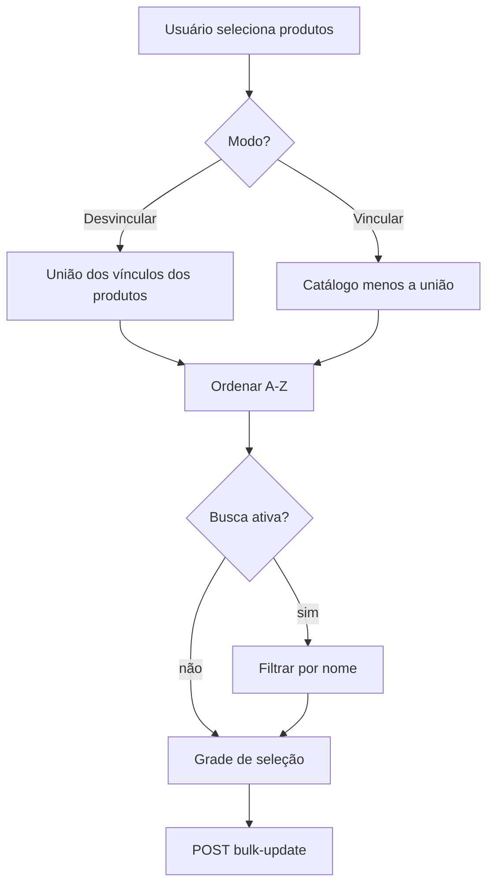

# Fluxo reutilizável: Vincular / Desvincular em lote

## 1. Objetivo

Padronizar a seleção de itens relacionados a **produtos** (ou outros alvos) em operações em lote, quando existem dois modos:

- **Vincular** (`adicionar`) — mostrar só o que **ainda não** pertence aos selecionados;
- **Desvincular** (`remover`) — mostrar só o que **já** pertence aos selecionados.

Consumidores atuais (e futuros) na UI do gestor:

| Aba / feature | Catálogo | Vínculo no produto |
|---|---|---|
| Impressoras | `Impressora[]` | `produto.getImpressoras()` |
| Grupos Complementos | `GrupoComplemento[]` | `produto.getGruposComplementos()` |

Qualquer nova aba “vincular X em lote” deve seguir este fluxo em vez de duplicar `useMemo`/`filter` no componente.

## 2. Onde vive o código

| Peça | Caminho | Responsabilidade |
|---|---|---|
| Helpers puros | `src/shared/helpers/filtroVinculoLote.ts` | União de IDs, filtro por modo, ordenação, busca, poda de seleção, textos de hint |
| Hook de UI | `src/presentation/hooks/useListaVinculoLote.ts` | Estado de busca, listas derivadas, “selecionar todas” visíveis, limpeza ao mudar modo |
| Tela | `src/presentation/components/features/produtos/AtualizarProdutosLote.tsx` | Orquestra produtos selecionados + chama o hook por catálogo |

Direção de dependência:

- `presentation` → `shared/helpers`
- helpers **não** dependem de React nem de entidades concretas (só genéricos + callbacks `getId` / `getNome` / `getVinculoIds`)

## 3. Regra de filtragem (contrato)

Seja `U` a **união** dos IDs já vinculados em pelo menos um alvo selecionado.

```
sem alvos selecionados  →  catálogo completo (exploração)
modo remover            →  catálogo ∩ U
modo adicionar          →  catálogo \ U
```

Depois do filtro de modo:

1. ordenar por nome (`pt-BR`);
2. filtrar por texto de busca (opcional);
3. podar a seleção: remover IDs que saíram da lista do modo (busca **não** poda a seleção).

### 3.1 Por que união (e não interseção)

- **Desvincular:** o usuário precisa ver qualquer vínculo presente na seleção para poder removê-lo dos produtos que o têm.
- **Vincular:** itens que já estão em algum produto selecionado somem da lista; evita “vincular de novo” o que já pertence ao conjunto. Se precisar completar vínculo só nos que faltam, selecione apenas esses produtos.

## 4. Fluxo (diagrama)



## 5. Como usar (checklist)

1. Calcular `idsJaVinculados` com `uniaoIdsVinculosDosAlvos(...)`.
2. Passar catálogo + `modo` + `temAlvosSelecionados` para `useListaVinculoLote`.
3. Renderizar `filtradas` na grade (não o catálogo cru).
4. Ao trocar o modo: limpar seleção **e** `limparBusca()`.
5. Empty states:
   - catálogo vazio → “Nenhum disponível”
   - `paraExibir` vazio com alvos → `emptyModo`
   - `filtradas` vazio com busca → “Nenhum encontrado para …”
6. Campo de busca: só exibir se `exibirBusca` (`catalogo.length > limiar`, padrão **5**).

### 5.1 Exemplo mínimo

```ts
import {
  uniaoIdsVinculosDosAlvos,
  TEXTOS_VINCULO_IMPRESSORAS,
} from '@/src/shared/helpers/filtroVinculoLote'
import { useListaVinculoLote } from '@/src/presentation/hooks/useListaVinculoLote'

const idsJaVinculados = useMemo(
  () =>
    uniaoIdsVinculosDosAlvos(
      produtos,
      produtosSelecionados,
      (p) => p.getId(),
      (p) => p.getImpressoras().map((i) => i.id)
    ),
  [produtos, produtosSelecionados]
)

const lista = useListaVinculoLote({
  catalogo: impressorasDisponiveis,
  getId: (i) => i.getId(),
  getNome: (i) => i.getNome(),
  idsJaVinculados,
  modo: modoImpressora,
  temAlvosSelecionados: produtosSelecionados.size > 0,
  selecionados: impressorasSelecionadas,
  setSelecionados: setImpressorasSelecionadas,
  textos: TEXTOS_VINCULO_IMPRESSORAS,
})
```

Para grupos de complementos, troque o catálogo, o `getVinculoIds` (`getGruposComplementos`) e use `TEXTOS_VINCULO_GRUPOS_COMPLEMENTOS`.

## 6. UX alinhada (obrigatória nas duas abas)

- Hint ao lado do toggle de modo (`hintModo`).
- Contagem: `selecionadas · filtradas/totalDoModo`.
- Área da grade com altura confortável (`max-h-48`).
- “Selecionar todas” age só sobre **itens visíveis** (respeita busca).

## 7. O que não colocar aqui

- payload / chamada HTTP de bulk-update (fica no componente ou use-case);
- regras de domínio de produto (ex.: `withImpressoras`);
- carregamento do catálogo (hooks `useImpressoras` / `useGruposComplementos`).

Este fluxo é **filtro de apresentação + seleção**, não regra de negócio de persistência.

## 8. Checklist antes de abrir PR em feature similar

- [ ] Usa `filtroVinculoLote` / `useListaVinculoLote` (sem `filter` duplicado no JSX)?
- [ ] Modos vincular/desvincular respeitam união `U`?
- [ ] Seleção é podada ao mudar modo/produtos?
- [ ] Grupos Complementos e Impressoras se comportam igual na UI?
- [ ] Docs deste arquivo atualizado se a regra mudar?
