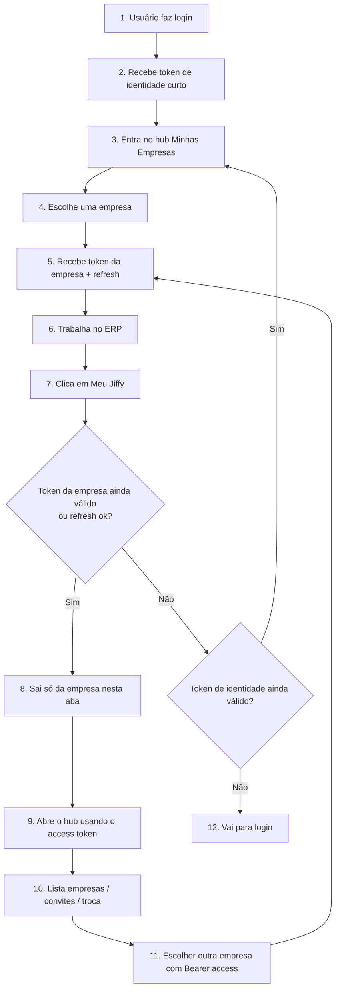

# Fluxo: Voltar ao Meu Jiffy com o token da empresa

## 1. Por que este documento existe

No gestor há **duas sessões** diferentes. Sem este mapa, um desenvolvedor tende a tratar o token do hub (`identity`) como se fosse a sessão longa do ERP — e aí aparecem toast de “Meu Jiffy expirado”, logout indevido e necessidade de F5/login enquanto a empresa ainda está válida.

Este fluxo conta a história correta, alinhada ao contrato do backend.

Leitura complementar:

- Sessão multi-tenant e cache: [`docs/MULTI-TENANT-JIFFY-DOC-OFICIAL.md`](../../MULTI-TENANT-JIFFY-DOC-OFICIAL.md)
- Login e rotas: [`docs/FLUXO_LOGIN_ATUAL.md`](../../FLUXO_LOGIN_ATUAL.md)

## 2. Os dois tokens (em português)

| Nome no produto | Nome técnico | Quando nasce | Quanto dura | O que abre |
|---|---|---|---|---|
| Token de identidade (hub) | `identityToken` / `identityAuth` | `POST /auth/login` | **Curta** (backend) | Hub `/minhas-empresas` logo após login |
| Token da empresa | `accessToken` / `tenantAuth` | `POST /auth/escolher-empresa` | Longa + **refresh** | ERP e também o hub **depois** de já ter empresa |

O backend documenta em `escolher-empresa`:

> use o token de identidade **logo após o login**, ou o **access** quando já houver sessão (troca de empresa).

Ou seja: o Meu Jiffy **não** precisa do identity se já existe access da empresa.

## 3. História feliz (como deve funcionar)



### Em uma frase

**Depois que o usuário já entrou numa empresa, o “último access token” é a chave do hub; o identity só vale no começo ou como fallback.**

## 4. O que o backend permite renovar

| Ação | Endpoint | Renova o quê? |
|---|---|---|
| Refresh | `POST /auth/refresh-token` | Só o **access da empresa** |
| Reidratar identity do cookie | BFF `GET /api/auth/identity-session` | **Não** estende TTL — só relê o cookie se ainda válido |
| Refresh do identity | — | **Não existe** no contrato atual |

Por isso avisos automáticos de “identity expirando” no ERP são ruído: a sessão longa do dia a dia é a da empresa.

## 5. Como estava (problema) — corrigido na implementação

Antes:

```mermaid
flowchart LR
  ERP[ERP com tenant ok] --> Clique[Clique Meu Jiffy]
  Clique --> Exige[Exige identity no cookie/Zustand]
  Exige -->|identity expirado| Login[/login + toast]
  Exige -->|identity ok| Hub[Hub]
```

Pontos que priorizavam só identity (já ajustados no código):

- `disconnectEmpresaTab` → usa `ensureHubBearerToken` (identity **ou** access/refresh)
- `MinhasEmpresasPage` → Bearer do hub resolvido na ordem do §9
- `useHubIdentityExpiryWarning` → **removido** do `TopNav`
- `logout-tenant` → **não** apaga mais o `refresh-token`

## 6. Como deve ficar (alvo)

| Passo | Comportamento |
|---|---|
| Clique Meu Jiffy | Se `tenantAuth` válido (ou refresh ok) → limpa tenant da aba e abre hub com esse access |
| Hub com access | Convites / escolher empresa usam Bearer do access |
| Sem access, com identity | Hub com identity (pós-login ou cookie ainda válido) |
| Sem access e sem identity | `/login` |
| Toast de identity no ERP | **Remover** — não pertence a este fluxo |

## 7. Checklist de implementação (quando for codar)

- [x] `disconnectEmpresaTab`: priorizar access/tenant; identity só fallback
- [x] Ao voltar ao Meu Jiffy: **não** apagar cookie `refresh-token` (só limpar tenant da aba)
- [x] Hub `/minhas-empresas` bootstrap: identity → senão refresh → access → senão login
- [x] Hub: aceitar Bearer access quando identity já expirou (qualquer aba)
- [x] Remover `useHubIdentityExpiryWarning` do `TopNav`
- [x] Atualizar testes de `disconnectEmpresaTab` / hub / `ensureHubBearerToken`
- [x] `escolher-empresa` BFF: cookie identity válido, senão Bearer access
- [x] Preservar `hubEmpresas` sem identity (sanitize + setHubEmpresas)

## 8. O que este fluxo não muda

- No **ERP**, hooks e APIs continuam só com `tenantAuth` (`useSecureTenantQuery`, `fetchGestorApi`) — ver doc multi-tenant.
- Cache React Query continua `['tenant', empresaId, ...]`.
- Logout completo (sair do Meu Jiffy / conta) continua limpando identity + tenant.

## 9. Caminho da tragédia: abas novas e a camada “global”

### 9.1 O que é local × o que é global hoje

| Camada | Onde | Escopo | Serve para |
|---|---|---|---|
| Token de identidade | `localStorage` + cookie `identity-token` | **Global** (todas as abas) | Hub pós-login |
| Lista `hubEmpresas` | `localStorage` | **Global** | Cards no hub |
| Token da empresa (`tenantAuth`) | `sessionStorage` | **Só esta aba** | ERP |
| Cookie `refresh-token` | httpOnly | **Global** (browser) | Renovar access da **última** empresa escolhida |
| Cookie `tenant-token` | httpOnly | Global, mas **não** é fonte de verdade do ERP | BFF auxiliar |

Conclusão: **não dá para “sempre usar o último access da aba”** quando o hub abre em aba nova — essa aba **não tem** o `sessionStorage` da aba do ERP.

### 9.2 Cenários reais

```mermaid
flowchart TD
  L[Login na Aba Portal] --> I[identity global no localStorage]
  I --> E1[Aba ERP: escolher empresa]
  E1 --> T[tenant só na Aba ERP]
  E1 --> R[refresh-token cookie global]

  I --> P[Aba Portal antiga ainda aberta<br/>ainda vê identity]
  R --> N[Aba nova: abre /minhas-empresas]

  N --> Q{O que a aba nova tem?}
  Q -->|identity ainda válido| H1[Hub com identity - ok]
  Q -->|identity expirado + refresh ok| H2[Mint access via refresh<br/>usar no hub - ok]
  Q -->|identity expirado + sem refresh| LGN[/login]
```

1. **Volta na aba do portal**  
   Ela compartilha o `identity` do `localStorage`. Enquanto o JWT de identidade não expirou, o hub ali funciona — mesmo com ERP aberto noutra aba. Quando o identity morrer, essa aba “antiga” também cai, **mesmo** com ERP vivo noutra aba (tragédia clássica).

2. **Abre Meu Jiffy em aba nova**  
   - Não herda `tenantAuth` da aba do ERP.  
   - Herda `identity` (se ainda válido) **ou** precisa de outra ponte global.  
   - A ponte longa que o backend já dá é o **`refresh-token` cookie** (não o access na memória da aba).

3. **Clica Meu Jiffy na mesma aba do ERP**  
   Ainda pode usar o access da aba **antes** de limpar o `sessionStorage`. Depois disso, o hub também depende da ponte global (identity ou refresh).

### 9.3 Por que “só o access da aba” não basta

O access em memória/`sessionStorage` é **por aba de propósito** (duas empresas em duas abas).  
O hub em aba nova precisa de uma **camada global de continuidade**, senão toda volta ao Meu Jiffy vira roleta do identity curto.

### 9.4 Camada global proposta (sem inventar token novo no backend)

Ordem de resolução no bootstrap do hub (`/minhas-empresas`), em **qualquer** aba:

1. **Identity válido** (Zustand/`localStorage` ou cookie) → Bearer identity  
2. Senão, **`POST /api/auth/refresh-token`** (cookie global) → recebe access → Bearer access no hub  
3. Senão → `/login`

Isso respeita o contrato: o backend já aceita access no hub / `escolher-empresa` quando já houve sessão de empresa.

### 9.5 Ajuste crítico no “sair da empresa”

Hoje `logout-tenant` **apaga também o `refresh-token`**.  
Se o Meu Jiffy chamar isso, **quebra a ponte global** da aba nova (e da própria aba após o redirect).

Para o fluxo alvo:

| Ação | Limpa `sessionStorage` da aba | Limpa cookie refresh | Limpa identity |
|---|---|---|---|
| Voltar ao Meu Jiffy | Sim | **Não** (mantém ponte global) | Não |
| Trocar de empresa | Sim (depois grava novo) | Substituído no `escolher-empresa` | Não |
| Logout da conta | Sim | Sim | Sim |

Em outras palavras: **voltar ao hub ≠ destruir a sessão renovável da empresa no browser**; só tira o tenant **desta aba**.

### 9.6 Limite consciente — mitigado no BFF (mapa de refresh)

Há cookie legado `refresh-token` (última empresa) para a **ponte do hub**.  
Além disso o BFF mantém `refresh-token-map` (`empresaId → refresh`), para abas ERP renovarem a **própria** empresa.

**Proteção no cliente:** `syncTenantAccessTokenClient` **recusa** gravar na aba um access cuja `empresaId` seja diferente da sessão atual. Bootstrap: se URL ≠ token → rebind via `escolher-empresa`.

Ver: [6.INVARIANTES_SESSAO_MULTI_ABA.md](./6.INVARIANTES_SESSAO_MULTI_ABA.md).

### 9.7 Em uma frase (multi-aba)

**O access da aba serve o ERP; a continuidade do Meu Jiffy entre abas é identity (curto) + refresh cookie (longo). Não misturar os dois papéis.**
