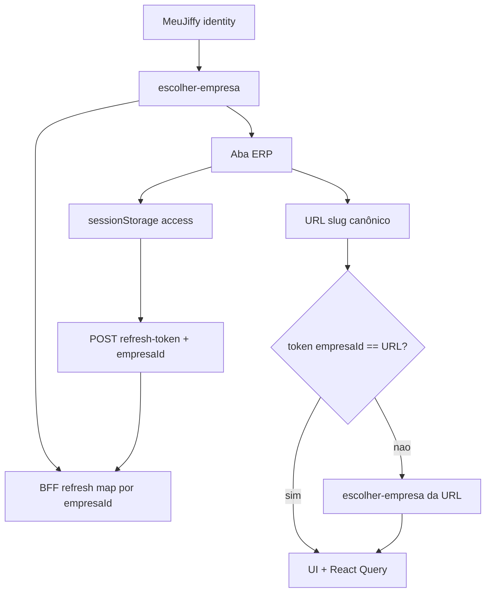

# Invariantes Jiffy — sessão multi-aba

Complementa: [4.FLUXO_VOLTAR_AO_MEU_JIFFY.md](./4.FLUXO_VOLTAR_AO_MEU_JIFFY.md), [MULTI-TENANT-JIFFY-DOC-OFICIAL.md](../../MULTI-TENANT-JIFFY-DOC-OFICIAL.md).

## Decisão de escopo

- **A (BFF):** mapa httpOnly de refresh por `empresaId`, sem exigir mudança imediata da API externa.
- **B (cliente):** URL/`empresaId` canônico + anti-mix no sync; bootstrap rebind se URL ≠ token.
- **Não usar Web Locks** (removidos; isolamento = URL + token + refresh map).

## Invariantes

1. **Canônico da aba** = `empresaId` alinhado ao slug da URL (`sessionStorage` + path).
2. **Nunca** gravar access de outra empresa nesta aba (`syncTenantAccessTokenClient`).
3. **Refresh** com `empresaId` usa **somente** o refresh do mapa dessa empresa (sem last-wins). Sem `empresaId` (hub) → cookie legado. Access renovado de outra empresa → recusar.
4. **Bootstrap:** se token da aba ≠ empresa da URL → `escolher-empresa` da URL (rebind), não herdar cegamente.
5. **Queries ERP** só com `tenantAuth` + `empresaId` da aba.

## Fluxo alvo

