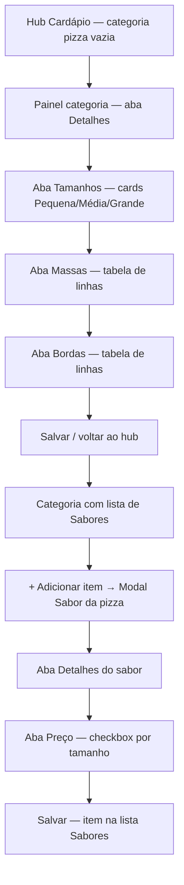

# Cardápio de Pizza — Contexto, API e Planejamento (Gestor v2)

> **Status:** documento de descoberta e planejamento — **sem implementação** nesta fase.  
> **Backend de referência:** `jiffy-backend` (`/api/v1/cardapio/pizza/*`)  
> **Frontend alvo:** `jiffy-gestor-v2`  
> **Arquitetura:** seguir [docs/arquitetura-jiffy](../arquitetura-jiffy/5.presentation/0.COMECE_POR_AQUI.md) e [BOAS_PRATICAS](../arquitetura-jiffy/1.boas-praticas/BOAS_PRATICAS.md)

---

## 1. Objetivo

Montar um fluxo completo no gestor para **cadastrar e manter cardápios de pizza**, alinhado:

1. ao que a API local já expõe;
2. ao modelo mental do **iFood** (categoria pizza → tamanhos → sabores → massas/bordas);
3. aos padrões visuais e de UX já usados em **produto preparado** (`ProdutoNovoWizard`, `MenuEditor`, `JiffySidePanelModal`).

Hoje, em `EscolherTipoProdutoModal`, a opção **Pizza** aparece como **“Em breve”** (`disponivel: false`). Este documento prepara a implementação futura.

---

## 2. Mapa da API (backend local)

### 2.1 Prefixo e autenticação

| Item | Valor |
|------|--------|
| Prefixo HTTP | `/api/v1/cardapio/pizza` |
| Swagger (paths relativos) | `/cardapio/pizza/...` em `jiffy-backend/docs/swagger/` |
| Auth | JWT gestor (`pdvGestorJwtAuthMiddleware`) |
| Subdomínio | `cardapio` |
| `empresaId` | vem do token — **nunca** enviar no body |

**Arquivos centrais no backend:**

- Rotas: `jiffy-backend/src/modules/cardapio/pizza/presentation/pizza-routes.ts`
- Controllers: `.../presentation/controllers/*PizzaController.ts`
- Validators: `.../domain/validators/pizza.validators.ts`
- Use cases: `.../application/use-cases/*-crud/`
- Repositório: `.../infra/repositories/PizzaPrismaRepository.ts`
- Swagger: `jiffy-backend/docs/swagger/routes/pizzaRoutesDocs.ts` + `schemas/pizzaSchemas.ts`

---

### 2.2 Modelo de dados (relações)

```
CategoriaPizza (grupoProdutos, tipoCategoria=pizza)
    │
    ├── GrupoPizzaConfig (1:1, config interna — NÃO retornada nos DTOs de categoria)
    │       ├── menuId (opcional)
    │       ├── regraPrecoMultiplosSabores: proporcional | maior
    │       ├── imprimir, permiteDesconto, permiteAcrescimo, ativo
    │       │
    │       ├── PizzaTamanho[] (pedaços, max divisões/sabores)
    │       ├── GrupoBordasPizza[] → BordaPizza[] (complementos)
    │       └── GrupoMassasPizza[] → MassaPizza[] (complementos)
    │
    └── SaborPizza[] (produto tipoProduto=pizza)
            └── precosTamanho[] → { pizzaTamanhoId, precoCheio }
```

**Observações importantes:**

- **Sabor** é um `produto` com preço **por tamanho** (matriz sabor × tamanho).
- **Bordas e massas** são grupos de complementos (`tipoGrupo`: `borda_pizza` | `massa_pizza`).
- **Soft delete** em todos os DELETEs (`ativo=false`, `dataExclusao`).
- **Reorder** existe só para **categorias** e **sabores** — não para tamanhos, bordas ou massas.

---

### 2.3 Endpoints por grupo

#### Pizza — Categorias (`/categorias`)

| Método | Path | Função |
|--------|------|--------|
| `POST` | `/categorias` | Cria categoria simples (+ config padrão interna) |
| `POST` | `/categorias/completo` | **Criação atômica**: categoria + config + tamanhos + sabores + grupos bordas/massas |
| `GET` | `/categorias` | Lista paginada (`offset`, `limit`, `q`, `ativo`) |
| `GET` | `/categorias/:id` | Detalhe |
| `PATCH` | `/categorias/:id` | Atualiza nome, ativo, imagem, cor, ícone |
| `PATCH` | `/categorias/:id/reordena-categoria` | Reordena (`{ novaPosicao }`) |
| `DELETE` | `/categorias/:id` | Soft delete + ajuste de ordem |

**Campos principais (create simples):** `nome`, `ativo`, `ativoDelivery`, `ativoLocal`, `imagemUrl`, `corHex`, `iconName`.

**Create completo — estrutura aninhada:**

```json
{
  "nome": "Pizzas Tradicionais",
  "corHex": "#530CA3",
  "iconName": "pizza",
  "config": {
    "menuId": null,
    "regraPrecoMultiplosSabores": "proporcional",
    "imprimir": true,
    "permiteDesconto": true,
    "permiteAcrescimo": true,
    "ativo": true
  },
  "tamanhos": [
    {
      "nome": "Grande",
      "quantidadePedacos": 8,
      "quantidadeMaximaDivisoes": 2,
      "ativo": true
    }
  ],
  "sabores": [
    {
      "nome": "Margherita",
      "descricao": null,
      "imagemUrl": null,
      "ativo": true,
      "precosTamanho": [
        { "nome": "Grande", "precoCheio": 59.9 }
      ]
    }
  ],
  "gruposBordas": [
    {
      "nome": "Bordas",
      "obrigatorio": false,
      "qtdMinima": 0,
      "qtdMaxima": 1,
      "ordem": 1,
      "bordas": [
        {
          "nome": "Catupiry",
          "descricao": null,
          "valor": 8,
          "tipoImpactoPreco": "aumenta",
          "ativo": true
        }
      ]
    }
  ],
  "gruposMassas": [
    {
      "nome": "Massas",
      "massas": [
        {
          "nome": "Integral",
          "valor": 5,
          "tipoImpactoPreco": "aumenta"
        }
      ]
    }
  ]
}
```

**Regras de negócio (create completo):**

- Transação única — falha em qualquer filho reverte tudo.
- Nomes de tamanhos **únicos** dentro da categoria.
- Preços de sabor no completo referenciam tamanho pelo **nome** (não ID).
- Nova categoria entra na **ordem 1**; demais categorias pizza incrementam ordem.

**Lacuna conhecida:** não há endpoint público para **atualizar `GrupoPizzaConfig`** após criação (só na criação / completo). Planejar extensão de API ou workaround na fase 2.

---

#### Pizza — Sabores (`/sabores`)

| Método | Path | Função |
|--------|------|--------|
| `POST` | `/sabores` | Cria sabor vinculado a `categoriaPizzaId` |
| `GET` | `/sabores` | Lista (`categoriaPizzaId`, paginação, `q`, `ativo`) — **summary** (sem preços) |
| `GET` | `/sabores/:id` | Detalhe com `precosTamanho[]` |
| `PATCH` | `/sabores/:id` | Parcial; `precosTamanho` **substitui** lista inteira se enviado |
| `PATCH` | `/sabores/:id/reordena-sabor` | Reordena dentro da categoria |
| `DELETE` | `/sabores/:id` | Soft delete |

**Create:** `nome`, `descricao`, `imagemUrl`, `ativo`, `categoriaPizzaId`, `precosTamanho: [{ pizzaTamanhoId, precoCheio }]`.

**Regra de preço múltiplos sabores** (`config.regraPrecoMultiplosSabores`):

| Valor | Comportamento esperado no PDV |
|-------|-------------------------------|
| `proporcional` | Meio a meio divide preço proporcionalmente |
| `maior` | Cobrar o **maior** preço entre os sabores escolhidos |

---

#### Pizza — Tamanhos (`/tamanhos`)

| Método | Path | Função |
|--------|------|--------|
| `POST` | `/tamanhos` | Requer `grupoPizzaConfigId` |
| `GET` | `/tamanhos` | Filtro por `categoriaPizzaId` |
| `GET` | `/tamanhos/:id` | Detalhe |
| `PATCH` | `/tamanhos/:id` | `nome`, `quantidadePedacos`, `quantidadeMaximaDivisoes`, `ativo` |
| `DELETE` | `/tamanhos/:id` | Soft delete |

**Campos:**

- `quantidadePedacos` — fatias (ex.: 8 para grande).
- `quantidadeMaximaDivisoes` — **máximo de sabores** no pedido (ex.: 2 = meio a meio).

> No iFood, isso equivale à configuração “quantidade máxima de sabores” por tamanho.

**Sem reorder** — ordem de exibição segue `nome ASC`.

---

#### Pizza — Grupo de bordas (`/grupo-bordas`)

| Método | Path | Função |
|--------|------|--------|
| `POST` | `/grupo-bordas` | Grupo + bordas aninhadas |
| `GET` | `/grupo-bordas` | Summary por `categoriaPizzaId` |
| `GET` | `/grupo-bordas/:id` | Grupo + `bordas[]` |
| `PATCH` | `/grupo-bordas/:id` | Metadados + delta de bordas |
| `DELETE` | `/grupo-bordas/:id` | Soft delete |

**PATCH — delta de bordas:**

```json
{
  "bordas": {
    "add": [{ "nome", "valor", "tipoImpactoPreco", ... }],
    "update": [{ "id", ...campos parciais }],
    "delete": ["bordaId"]
  }
}
```

**Campos do grupo:** `obrigatorio`, `qtdMinima`, `qtdMaxima`, `ordem`, `ativo`.

**`tipoImpactoPreco`:** `nenhum` | `aumenta` | `diminui`.

---

#### Pizza — Grupo de massas (`/grupo-massas`)

Espelha **grupo-bordas**, trocando `bordas[]` por `massas[]` e `tipoGrupo` interno `massa_pizza`.

---

### 2.4 Resumo operacional

| Recurso | Reorder | Listagem traz filhos | Update filhos |
|---------|---------|----------------------|---------------|
| Categoria | Sim | Não | PATCH simples (sem config) |
| Sabor | Sim | Summary | PATCH (preços replace) |
| Tamanho | Não | — | PATCH |
| Grupo bordas | Não | Summary | PATCH delta |
| Grupo massas | Não | Summary | PATCH delta |

---

## 3. Referência iFood (fluxo de cardápio pizza)

Com base em documentação pública de parceiros e integradores ([Portal do Parceiro iFood](https://blog-parceiros.ifood.com.br/novo-cardapio-ifood/), [ajuda integração pizzas](https://meajuda.saipos.com/hc/pt-br/articles/20212116749332)):

### 3.1 Estrutura no iFood

1. **Categoria especial “Pizzas”** — não é categoria comum de item avulso.
2. Dentro da categoria, abas/contexto:
   - **Tamanhos** — cada tamanho define fatias e **máximo de sabores** (meio a meio).
   - **Sabores** — cada sabor com preço **por tamanho** (matriz).
   - **Massas** — massas especiais **e bordas** (integradores recomendam cadastrar bordas na aba Massas por limitação de código PDV no iFood).
3. **Código PDV** por tamanho/sabor/complemento para integração — no Jiffy isso mapeia para IDs internos (`produto`, `complementoProduto`, templates de tamanho).

### 3.2 Paralelo iFood ↔ Jiffy Backend

| iFood (conceito) | Jiffy API |
|------------------|-----------|
| Categoria Pizzas | `CategoriaPizza` |
| Aba Tamanhos | `PizzaTamanho` + `quantidadeMaximaDivisoes` |
| Sabores + preço por tamanho | `SaborPizza.precosTamanho` |
| Aba Massas (massas + bordas) | `GrupoMassasPizza` + `GrupoBordasPizza` |
| Regra meio a meio | `regraPrecoMultiplosSabores` |
| Ordem de sabores/categorias | `reordena-sabor` / `reordena-categoria` |

### 3.3 UX desejada (inspirada iFood, adaptada Jiffy)

- Setup da **categoria pizza** em painel com abas (Detalhes → Tamanhos → Massas → Bordas), como no Portal iFood.
- **Sabores** cadastrados depois, via lista na categoria + modal dedicado (Detalhes | Preço).
- Matriz de preços **sabor × tamanho** na aba Preço do sabor (checkbox por tamanho + valor).
- Reordenar categorias e sabores (DnD ou modal já usado no menu).
- Aviso ao sair com rascunho (`JiffyUnsavedChangesDialog`).
- **Tour guiado** (popovers “Recomendações”) → **V2** — ver seção 11.

---

## 11. Análise UX — prints do fluxo iFood (vídeo passo a passo)

> Fonte: sequência de telas capturadas do Portal do Parceiro iFood ao montar categoria **“Pizzas Tradicionais”** e o sabor **“Pizza de Mussarela”**.  
> **Escopo V1:** reproduzir estrutura, campos e fluxo. **Escopo V2:** modais de onboarding guiado (“Recomendações” com barra de progresso).

### 11.1 Visão macro do fluxo iFood (ordem real)



**Diferença importante vs. plano anterior:** no iFood, **sabores não entram no mesmo wizard da categoria**. Primeiro configura-se a categoria (tamanhos, massas, bordas); depois adicionam-se sabores um a um na lista.

---

### 11.2 Tela a tela — o que o iFood mostra e como traduzir para o Jiffy

#### Tela 1 — Hub do cardápio (categoria vazia)

| Elemento iFood | Comportamento | Jiffy proposto |
|----------------|---------------|----------------|
| Card **“Pizzas Tradicionais”** + badge “Categoria vazia” | Categoria pizza criada sem sabores | `PizzasListPage` ou card dentro de `/produtos/pizzas` |
| **+ Adicionar item** | Inicia cadastro de **sabor** (não de categoria) | Botão abre `PizzaSaborModal` (categoria já selecionada) |
| Menu ⋮ na categoria | Editar categoria / config | Abre `PizzaCategoriaSetupPanel` (abas) |
| **Salvar alterações** (footer global, disabled) | Persistência batch do cardápio | No Jiffy: save por aba/modal ou auto-save por PATCH |
| Banner recomendações | Dicas de catálogo | **V2** — opcional |

**Nota:** antes de “Adicionar item”, o vídeo passa pelo **setup da categoria** (telas 2–6). Entrada alternativa: **+ Nova categoria pizza** → abre setup sem sabores.

---

#### Tela 2 — Setup categoria: aba **Detalhes**

| Campo / UI | iFood | API Jiffy | Componente Jiffy |
|------------|-------|-----------|------------------|
| Título | “Pizzas Tradicionais” | `nome` | `UppercaseLocaleInput` ou MUI compact |
| Subtítulo | “Detalhes da categoria” | — | `h2` + divisor `bg-primary/70` |
| Abas | Detalhes · Tamanhos · Massas · Bordas | — | Tabs no topo do painel (underline `primary`, não vermelho iFood) |
| Rodapé | Cancelar (outline) · **Próximo** (solid) | — | `JiffySidePanelModal` `barSecondaryTone: primary` |

**Tour guiado (V2):** popover “Selecione o tipo de pizza…” apontando categoria — **não implementar na V1**.

**Campos implícitos na aba Detalhes (expandir vs iFood):** nome, cor, ícone, imagem, ativo, regra meio a meio (`regraPrecoMultiplosSabores`) — iFood não expõe tudo nesta aba; Jiffy pode agrupar **Detalhes + Config** na mesma aba.

---

#### Tela 3 — Aba **Tamanhos**

| Elemento iFood | Detalhe | Mapeamento API |
|----------------|---------|----------------|
| Link **+ Novo tamanho** | Adiciona card | `POST /tamanhos` |
| **Cards horizontais** (não tabela) | Pequena / Média / Grande | Um card por `PizzaTamanho` |
| Ícone pizza | Visual (inteira vs meio) | Decorativo — ícone por `quantidadeMaximaDivisoes` |
| Texto descritivo | “Cortada em 8 pedaços” | `quantidadePedacos` |
| Texto sabores | “Aceita 1 e 2 sabores” | `quantidadeMaximaDivisoes` |
| Toggle **Pausar / Ativado** | Status de venda | `ativo` |
| Drag handle (⋮⋮) nos cards | Reordenar | ⚠️ API **sem reorder** de tamanho — ordenar por nome ou backlog backend |
| Rodapé | Cancelar · **Próximo** | Avança para aba Massas |

**Layout Jiffy (wireframe):**

```
┌─────────────────────────────────────────────────────────┐
│ [Detalhes] [Tamanhos●] [Massas] [Bordas]                │
├─────────────────────────────────────────────────────────┤
│  + Novo tamanho                                         │
│  ┌──────────┐ ┌──────────┐ ┌──────────┐                 │
│  │ ⋮⋮ 🍕    │ │ ⋮⋮ 🍕½   │ │ ⋮⋮ 🍕½   │  ← scroll-x    │
│  │ Pequena  │ │ Média    │ │ Grande   │                 │
│  │ 1 pedaço │ │ 6 pedaços│ │ 8 pedaços│                 │
│  │ 1 sabor  │ │ 1–2 sab. │ │ 1–2 sab. │                 │
│  │[Pausar|Ativo]│ ...    │ │ ...      │                 │
│  └──────────┘ └──────────┘ └──────────┘                 │
├─────────────────────────────────────────────────────────┤
│ [Fechar]                    [Anterior] [Continuar →]       │
└─────────────────────────────────────────────────────────┘
```

**Presets sugeridos ao criar:** Broto/Pequena (1 pedaço, 1 sabor), Média (6, 2), Grande (8, 2).

---

#### Tela 4 — Aba **Massas**

| Coluna iFood | Campo | API |
|--------------|-------|-----|
| ⋮⋮ drag | ordem | `ordem` no grupo (fixo na criação) |
| **Massa** | nome | `MassaPizza.nome` |
| **Preço** | adicional R$ | `valor` + `tipoImpactoPreco` |
| **Status de vendas** | Pausar/Ativado | `ativo` |
| **Cód. PDV** | integração | **V2 / Fase 4** — omitir V1 |
| **+ Adicionar massa** | nova linha | delta `add` ou POST nested |

**Tour guiado (V2):** “Tipos de massas — opções que o cliente terá…”

**Layout:** tabela editável inline (similar `GrupoItem` / linhas de complemento), fundo branco, bordas `border-gray-200`.

**Default sugerido:** linha “Tradicional” R$ 0,00 ativo (como iFood).

---

#### Tela 5 — Aba **Bordas**

Idêntica à aba Massas, trocando rótulos:

| Coluna | API |
|--------|-----|
| Borda | `BordaPizza.nome` |
| Preço | `valor` |
| Status | `ativo` |
| + Adicionar borda | delta / POST |

**Tour guiado (V2):** “Tipos de bordas…”

Rodapé nesta aba: **Cancelar · Salvar** (última aba do setup — persiste categoria).

---

#### Tela 6 — Hub com categoria configurada + **lista Sabores**

| Coluna iFood | Conteúdo | Jiffy |
|--------------|----------|-------|
| **Sabores** | drag, thumb, nome, descrição curta | `PizzaSaborListItem` |
| **Tamanho** | “Disponível em 3 tamanhos” | Contagem de tamanhos ativos |
| **Preço** | “À partir de R$ 20,00” | `min(precosTamanho.precoCheio)` |
| **Status de vendas** | Pausar/Ativado | `ativo` do sabor |
| **+ Adicionar item** | abre modal sabor | `PizzaSaborModal` |

Toggle **Pausar/Ativado** no header da categoria controla `CategoriaPizza.ativo`.

---

#### Tela 7 — Modal **“Sabor da pizza”** — aba **Detalhes**

| Campo iFood | Limite / detalhe | API Jiffy |
|-------------|------------------|-----------|
| **Categoria** | dropdown readonly (“Pizzas Tradicionais”) | `categoriaPizzaId` |
| **Sabor** | 0/80 caracteres | `nome` |
| **Descrição** | 0/1000, placeholder com ingredientes | `descricao` |
| **Imagem do item** | JPEG/PNG/HEIC, max 20MB, min 300×275 | `imagemUrl` + upload intent (padrão produto) |
| **Código PDV** | 0/60 | **V2** |
| Abas | Detalhes · **Preço** · Classificação | V1: Detalhes + Preço; Classificação **V2** |

**Tour guiado (V2):** sequência em Categoria → Sabor → Descrição (3–5 passos com preview “Portuguesa”).

Rodapé: **Cancelar** (outline) · **Continuar** (disabled até válido) → vai para aba Preço.

---

#### Tela 8 — Modal sabor — aba **Preço**

| Elemento iFood | Comportamento | API |
|----------------|---------------|-----|
| Título dinâmico | “Pizza de Mussarela” | `nome` já preenchido |
| **Checkbox por tamanho** | Pequena, Média, Grande | quais tamanhos o sabor atende |
| **Input R$** abaixo de cada tamanho marcado | preço cheio | `precosTamanho[].precoCheio` |
| Continuar | habilita após ≥1 preço | validação client |

**Layout Jiffy:**

```
Pequena ☑   Média ☑   Grande ☑
  R$ [__]     R$ [__]     R$ [__]
```

Salvar → `POST /sabores` ou `PATCH` se edição.

**Classificação (iFood):** alérgenos / tags — **fora do escopo V1** (sem campo equivalente direto na API pizza atual).

---

#### Telas 9+ — Combos e complementos genéricos (referência)

O vídeo também mostra fluxos de **Combo 2 Pizzas** e **grupos de complementos** (obrigatoriedade, min/max, tipo Preparado/Industrializado). Isso é **produto combo + complementos**, não o núcleo pizza.

| Fluxo iFood | Escopo Jiffy |
|-------------|--------------|
| Combo promocional | **Backlog** — produto combo separado |
| Novo grupo de complementos | Reutilizar `ComplementosMultiSelectDialog` se combo precisar |
| Escolha 2 pizzas (grupo obrigatório) | Modelagem futura; não bloqueia MVP pizza |

---

### 11.3 Padrões visuais iFood → tokens Jiffy

| iFood | Jiffy (não copiar vermelho) |
|-------|------------------------------|
| Aba ativa vermelha + underline | Aba ativa `text-primary` + `border-b-2 border-primary` |
| Botão primário vermelho | `bg-primary text-white` (`barSecondaryTone: primary`) |
| Botão cancelar outline vermelho | `dangerOutline` ou `primaryTint10` conforme contexto menu/cadastro |
| Cards tamanho com sombra leve | `rounded-lg border border-gray-200 bg-white shadow-sm` |
| Toggle Pausar/Ativado segmentado | `JiffyIconSwitch` ou segment control existente no ERP |
| Painel lateral sobre overlay escuro | `JiffySidePanelModal` + backdrop `rgba(0,0,0,0.5)` |
| Seções `bg-info` + título primary | Igual `ProdutoNovoWizard` / `NovoGrupo` |

---

### 11.4 Escopo explícito V1 vs V2

| Recurso | V1 | V2 |
|---------|----|----|
| Setup categoria (4 abas) | Sim | — |
| Modal sabor (Detalhes + Preço) | Sim | — |
| Lista sabores na categoria | Sim | — |
| Reorder categorias/sabores | Sim | — |
| Massas/bordas inline | Sim | — |
| Upload imagem sabor | Sim | — |
| **Tour guiado / Recomendações** | Não | Sim |
| Código PDV | Não | Sim (integração) |
| Aba Classificação do sabor | Não | Sim |
| Combos pizza | Não | Backlog |
| Banner recomendações catálogo | Não | Opcional |
| Importar cardápio por arquivo | Não | Backlog |

---

### 11.5 Componentes UI propostos (inventário)

| Componente | Responsabilidade |
|------------|------------------|
| `PizzasHubPage` | Lista categorias + cards vazios/cheios |
| `PizzaCategoriaSetupPanel` | Abas Detalhes · Tamanhos · Massas · Bordas |
| `PizzaTamanhoCards` | Cards horizontais com toggle ativo |
| `PizzaMassaBordaTable` | Tabela inline add/edit/remove |
| `PizzaCategoriaSaboresSection` | Tabela sabores + “Adicionar item” |
| `PizzaSaborModal` | Abas Detalhes · Preço (tabs internas) |
| `PizzaSaborPrecoStep` | Checkboxes tamanho + inputs moeda |
| `PizzaReorderModal` | Reutilizar padrão menu reorder |

---


## 4. Estado atual no gestor v2

| Área | Situação |
|------|----------|
| `EscolherTipoProdutoModal` | Opção pizza **desabilitada** (“Em breve”) |
| Menus / produtos | Filtro `tipo: pizza` em catálogo de menu — backend de menu já distingue produto pizza |
| BFF pizza | **Não existe** — nenhuma rota `/api/.../pizza` no gestor |
| Repositório cliente | **Não existe** `PizzaBffRepository` |
| Telas pizza | **Nenhuma** |

**Padrões visuais a reutilizar:**

- Painel lateral: `JiffySidePanelModal` + `footerVariant="bar"`.
- Wizard multi-step: `ProdutoNovoWizard` (stepper no topo, `bg-info`, seções com título + divisor `h-px bg-primary/70`).
- Botões: Fechar `dangerOutline` (menu) / `primaryTint10` (cadastro); navegação `barSecondaryTone: 'primary'`.
- Formulários MUI compactos: `sxEntradaCompactaProduto`, `UppercaseLocaleInput` para nomes.
- Confirmação de saída: `JiffyUnsavedChangesDialog`.
- Reordenar: padrão `MenuReorderCardapioModal` / `@dnd-kit`.

---

## 5. Arquitetura proposta (gestor v2)

Seguindo Clean Architecture do projeto:

```
app/api/cardapio/pizza/**/route.ts          ← BFF (proxy + Zod + auth tenant)
src/application/use-cases/pizza/**          ← orquestração
src/application/dto/pizza/**                ← schemas espelhando backend
src/infrastructure/api/repositories/PizzaBffRepository.ts
src/domain/repositories/IPizzaRepository.ts ← interface
src/presentation/components/features/pizza/** ← UI
src/presentation/hooks/pizza/**             ← React Query
src/shared/types/pizza.ts                   ← tipos compartilhados
```

**Princípios (arquitetura-jiffy):**

- Regras de preço múltiplos sabores, validação de ordem e soft delete **permanecem no backend** — gestor só orquestra.
- BFF valida entrada (Zod) como já feito em `MenuInputSchemas` + `menuRouteValidation`.
- Presentation **não** chama backend externo direto — usa BFF + hooks.
- Evitar duplicar markup de confirmação/lista — componentes compartilhados.

**Proxy pattern (igual menus):**

```
Browser → /api/cardapio/pizza/categorias → jiffy-backend /api/v1/cardapio/pizza/categorias
```

---

## 6. Fluxo completo proposto (UX) — revisado com base nos prints iFood

> **Mudança principal:** separar **configuração da categoria** (tamanhos, massas, bordas) de **cadastro de sabores** (modal item a item), como no iFood. O wizard linear anterior (steps 0–6 incluindo sabores) foi substituído por este modelo.

### 6.1 Entrada no fluxo

**Caminho A — Cadastro base (Produtos)**

1. **Novo produto** → `EscolherTipoProdutoModal` → **Pizza** (habilitar).
2. Se não existe categoria: **+ Nova categoria pizza** → `PizzaCategoriaSetupPanel`.
3. Se categoria existe: abrir hub → **+ Adicionar item** (sabor) → `PizzaSaborModal`.

**Caminho B — Dentro de um menu**

1. MenuEditor → adicionar categoria/sabor pizza.
2. `config.menuId` preenchido no create completo ou vínculo posterior.

**Caminho C — Hub `/produtos/pizzas`**

- Lista categorias pizza (cards como iFood).
- Categoria vazia → CTA configurar categoria **ou** adicionar sabor (após tamanhos).

---

### 6.2 Fase A — Setup da categoria (`PizzaCategoriaSetupPanel`)

Painel lateral largo com **4 abas horizontais** (espelho iFood), não wizard numerado:

| Aba | Conteúdo | Persistência |
|-----|----------|--------------|
| **Detalhes** | Nome, cor, ícone, imagem, ativo, regra meio a meio, flags config | Rascunho → `POST /categorias/completo` no Salvar **ou** PATCH incremental |
| **Tamanhos** | Cards: nome, pedaços, máx. sabores, ativo; + Novo tamanho | Incluído no completo ou `POST /tamanhos` |
| **Massas** | Tabela inline: nome, preço, ativo | `gruposMassas` no completo ou CRUD grupo |
| **Bordas** | Tabela inline: nome, preço, ativo | `gruposBordas` no completo ou CRUD grupo |

**Navegação entre abas:**

- **Detalhes → Tamanhos → Massas → Bordas:** botões **Anterior / Continuar** (primary).
- Última aba (**Bordas**): **Cancelar · Salvar** (persiste categoria).
- **Fechar / backdrop:** `JiffyUnsavedChangesDialog` se rascunho dirty.

**Primeira categoria (onboarding):** preferir **`POST /categorias/completo`** em um único Salvar na aba Bordas.  
**Edição posterior:** abrir mesmas abas com PATCH por entidade.

---

### 6.3 Fase B — Sabores (`PizzaSaborModal` + lista)

Após categoria configurada, hub exibe seção **Sabores** (tabela iFood):

| Coluna | Fonte |
|--------|-------|
| Sabor (thumb + nome + descrição) | `SaborPizza` |
| Tamanho | “Disponível em N tamanhos” (tamanhos com preço > 0) |
| Preço | “À partir de R$ X” (min dos preços) |
| Status | toggle ativo |

**+ Adicionar item** abre `PizzaSaborModal`:

| Aba modal | Campos | API |
|-----------|--------|-----|
| **Detalhes** | Categoria (readonly), sabor, descrição, imagem | `POST/PATCH /sabores` |
| **Preço** | Checkbox por tamanho + R$ cada | `precosTamanho[]` |

Rodapé modal: **Cancelar · Continuar** (entre abas) · **Salvar** (aba Preço).

**Classificação** (iFood): omitir V1.

---

### 6.4 Hub de edição contínua (`PizzaCategoriaTabsModal`)

Para quem prefere **todas** as abas num único lugar após criação (alternativa ao setup inicial):

| Aba | Equivalente iFood |
|-----|-------------------|
| Geral | Detalhes |
| Tamanhos | Cards tamanhos |
| Sabores | Lista + modal |
| Massas | Tabela massas |
| Bordas | Tabela bordas |
| Cardápios | V2 — vínculo menu |

> **Decisão:** `PizzaCategoriaSetupPanel` (criação) e `PizzaCategoriaTabsModal` (edição) podem compartilhar os mesmos subcomponentes (`PizzaTamanhoCards`, `PizzaMassaBordaTable`, `PizzaCategoriaSaboresSection`).

---

### 6.5 Lista de categorias (`PizzasHubPage`)

| Elemento | Detalhe |
|----------|---------|
| Card categoria | Nome, status vazio/cheio, toggle ativo, ⋮ menu |
| Estado vazio | “Categoria vazia” + configurar + adicionar sabor |
| Reorder | `reordena-categoria` |
| Salvar alterações global | Opcional V1 — preferir save por painel |

---

## 7. Matriz de implementação por fases

### Fase 0 — Fundação (BFF + tipos)

- [ ] Tipos Zod espelhando `pizzaSchemas.ts` do backend.
- [ ] Rotas BFF para os 23 endpoints.
- [ ] `PizzaBffRepository` + use cases finos (Listar, Criar, Atualizar, Reordenar).
- [ ] Hooks React Query (`usePizzaCategorias`, `usePizzaSabores`, …).
- [ ] Testes unitários dos mappers (precosTamanho nome→id no completo).

### Fase 1 — MVP (paridade fluxo iFood core)

- [ ] Habilitar opção Pizza em `EscolherTipoProdutoModal`.
- [ ] `PizzasHubPage` com card de categoria (vazio/cheio).
- [ ] `PizzaCategoriaSetupPanel` — abas Detalhes · Tamanhos · Massas · Bordas.
- [ ] `POST /categorias/completo` no Salvar da aba Bordas.
- [ ] `PizzaCategoriaSaboresSection` + `PizzaSaborModal` (Detalhes + Preço).
- [ ] `JiffyUnsavedChangesDialog` nos painéis.

### Fase 2 — Edição e reorder

- [ ] `PizzaCategoriaTabsModal` (reuso dos subcomponentes do setup).
- [ ] Reorder categorias e sabores (DnD).
- [ ] PATCH incremental tamanhos/massas/bordas/sabores.

### Fase 3 — Menu e config avançada

- [ ] Vínculo com `MenuEditor` / aba Cardápios.
- [ ] Endpoint backend **PATCH GrupoPizzaConfig** (regra meio a meio editável).
- [ ] Upload imagem sabor (upload intent).

### Fase 4 — V2 e integrações

- [ ] **Tour guiado** (popovers Recomendações por aba/campo).
- [ ] Código PDV / classificação do sabor.
- [ ] Combos pizza.
- [ ] Preview pedido cliente (tamanho → sabores → massa → borda).

---

## 8. Decisões em aberto

| # | Decisão | Recomendação (atualizada) |
|---|---------|---------------------------|
| 1 | Rota dedicada `/pizzas` vs aba em Produtos | Hub **`/produtos/pizzas`** na v1 |
| 2 | Wizard linear vs abas iFood | **Abas** (Detalhes/Tamanhos/Massas/Bordas) + modal sabor separado |
| 3 | Sabores no create completo vs depois | **Depois** (como iFood); completo pode ir sem `sabores[]` |
| 4 | Tamanhos: cards vs tabela | **Cards** horizontais (iFood) |
| 5 | Massas/bordas: abas separadas | **Sim** — duas abas distintas |
| 6 | Tour guiado | **V2** explícito |
| 7 | Código PDV / Classificação | **V2 / Fase 4** |
| 8 | Update `GrupoPizzaConfig` | Issue backend antes de editar regra meio a meio |
| 9 | `ativoDelivery` / `ativoLocal` | Omitir na v1 (legado) |

---

## 9. Referências

### Backend (jiffy-backend)

- Módulo: `src/modules/cardapio/pizza/`
- Swagger: `docs/swagger/routes/pizzaRoutesDocs.ts`
- Migration inicial: `prisma/migrations/20260812151913_adiciona_tabelas_do_fluxo_pizza/`

### Gestor (jiffy-gestor-v2)

- Wizard produto: `src/presentation/components/features/produtos/ProdutoNovoWizard.tsx`
- Escolha tipo: `src/presentation/components/features/produtos/EscolherTipoProdutoModal.tsx`
- Menu: `src/presentation/components/features/menus/MenuEditor.tsx`
- Confirmação saída: `src/presentation/components/ui/JiffyUnsavedChangesDialog.tsx`

### iFood (web + prints do fluxo)

- [Novo Cardápio iFood](https://blog-parceiros.ifood.com.br/novo-cardapio-ifood/)
- [Cadastro códigos PDV — categoria pizza, tamanhos, massas](https://meajuda.saipos.com/hc/pt-br/articles/20212116749332-Cadastro-de-c%C3%B3digos-de-integra%C3%A7%C3%A3o-de-pizzas-no-iFood)
- [Códigos PDV no cardápio](https://blog-parceiros.ifood.com.br/cadastro-codigos-pdv/)
- Seção **11** deste documento — decomposição tela a tela dos prints do vídeo

---

## 10. Próximo passo (quando for implementar)

1. Validar com produto: fluxo **categoria primeiro, sabores depois** (seção 11.1).
2. Validar wireframes das abas Tamanhos (cards) e Massas/Bordas (tabela).
3. Abrir issue backend para **PATCH GrupoPizzaConfig**.
4. Iniciar **Fase 0** (BFF) → **Fase 1** (`PizzaCategoriaSetupPanel` + `PizzaSaborModal`).
5. Tour guiado fica registrado como **V2** — não estimar na v1.

---

*Documento atualizado em 27/08/2026 — inclui análise dos prints iFood (vídeo passo a passo) e revisão do fluxo UX.*
