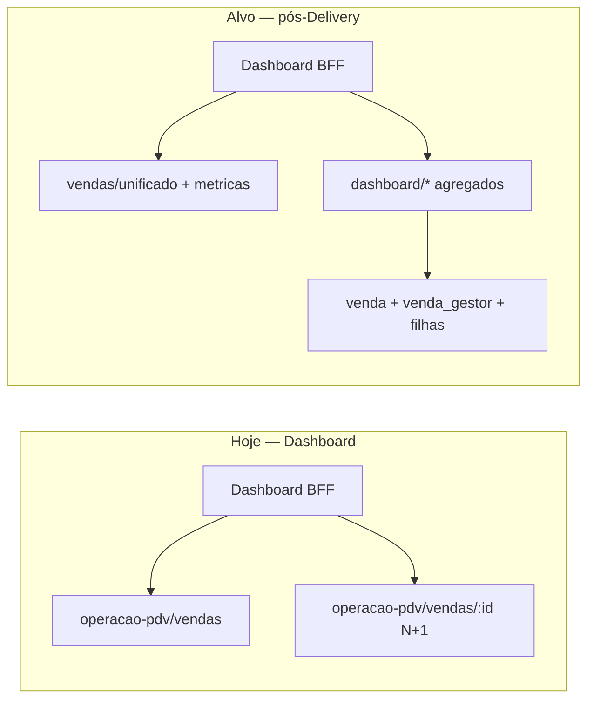

# Dashboard V2 — Análise de fluxo e referência para refatoração (performance)

Documento de trabalho para a refatoração **frontend + backend** do dashboard.  
Objetivo: reduzir tempo de carregamento, eliminar N+1 no BFF e mover agregações para onde a regra de negócio deve viver.

**Página:** `app/(erp)/dashboard/page.tsx` → `dashboardV2.tsx`  
**Data da análise:** maio/2026  
**Docs relacionados:** `dashboard-v2-levantamento.md`, `PLANO_OTIMIZACAO_DASHBOARD_FRONTEND.md`, `dashboard-v2-melhorias-*.md`

**Parte 1 (§1–§12):** fluxo atual do dashboard no frontend/BFF.  
**Parte 2 (§13–§20):** análise minuciosa do **jiffy-backend** — migração de PDV-only para **vendas unificadas** (PDV + Gestor/Delivery).

---

## 1. Objetivo desta refatoração

| Meta | Descrição |
|------|-----------|
| **Performance** | Menos round-trips browser ↔ servidor e menos chamadas BFF ↔ API PDV |
| **Responsabilidade** | Cálculos de métricas, rankings e séries temporais no **backend** (jiffy-backend), não no Next.js BFF nem no React |
| **Manutenção** | Uma fonte de verdade por bloco (resumo, evolução, pagamentos, tops) |
| **Fuso horário** | Períodos calculados de forma consistente (empresa timezone) em um único lugar |

---

## 2. Arquitetura atual

```mermaid
flowchart TB
  subgraph browser [Browser — dashboardV2.tsx]
    F1[useEmpresaMe]
    F2[useDashboardResumoQuery]
    F3[useDashboardEvolucaoComparativoQuery x2]
    F4[useDashboardMetodosPagamentoDetalhadoQuery]
    F5[useDashboardTopProdutosQuery]
    F6[useDashboardTopGarconsQuery]
    F7[useDashboardFaturamentoPorDiaQuery — só modal]
  end

  subgraph bff [Next.js BFF — app/api/dashboard/*]
    R1[/resumo]
    R2[/evolucao-comparativo]
    R3[/metodos-pagamento]
    R4[/top-produtos]
    R5[/top-garcons]
    R6[/evolucao]
  end

  subgraph ext [jiffy-backend — API externa]
    V[/api/v1/operacao-pdv/vendas]
    VD[/api/v1/operacao-pdv/vendas/:id]
    E[/api/v1/empresas/me]
    U[/api/v1/pessoas/usuarios-pdv/:id]
    P[/api/v1/cardapio/produtos/:id]
    M[/api/v1/pagamento/meios-pagamento]
  end

  F1 --> E
  F2 --> R1
  F3 --> R2
  F4 --> R3
  F5 --> R4
  F6 --> R5
  F7 --> R6

  R1 --> V
  R2 --> V
  R2 --> E
  R3 --> V
  R3 --> VD
  R3 --> M
  R4 --> V
  R4 --> VD
  R4 --> P
  R5 --> V
  R5 --> VD
  R5 --> U
  R6 --> V
  R6 --> E
```

**Observação importante:** não existe módulo `dashboard` no **jiffy-backend** hoje. Toda agregação pesada roda no **BFF Next.js** (`jiffy-gestor-v2/app/api/dashboard/`), que por sua vez fan-out para `operacao-pdv/vendas` e endpoints auxiliares.

---

## 3. O que dispara ao abrir a tela (período padrão: Hoje)

### 3.1 Requisições do browser → BFF (paralelas)

| # | Hook / origem | Rota BFF | Quando |
|---|---------------|----------|--------|
| 1 | `useEmpresaMe` | `GET /api/empresas/me` | Sempre (timezone, empresa) |
| 2 | `useDashboardResumoQuery` | `GET /api/dashboard/resumo` | Sempre |
| 3 | `useDashboardEvolucaoComparativoQuery` | `GET /api/dashboard/evolucao-comparativo` | Sempre (fase 1 — só período atual) |
| 4 | `useDashboardEvolucaoComparativoAnteriorQuery` | `GET /api/dashboard/evolucao-comparativo?somenteComparativo=1` | Após fase 1 concluir |
| 5 | `useDashboardMetodosPagamentoDetalhadoQuery` | `GET /api/dashboard/metodos-pagamento` | Quando `inicioResumo`/`fimResumo` existem |
| 6 | `useDashboardTopProdutosQuery` | `GET /api/dashboard/top-produtos` | Quando intervalo do card calculado |
| 7 | `useDashboardTopGarconsQuery` | `GET /api/dashboard/top-garcons` | Idem |
| 8 | `useDashboardFaturamentoPorDiaQuery` | `GET /api/dashboard/evolucao` | **Só** com modal de intervalo personalizado aberto |

**Total típico na abertura:** ~7 requisições HTTP do browser + 1 segunda onda (comparativo anterior).

### 3.2 Cálculos de período ainda no frontend (`dashboardV2.tsx`)

Antes de chamar as APIs, o cliente calcula:

- Intervalo atual e anterior (`calcularPeriodoNoFusoEmpresa`, `calcularPeriodoAnteriorParaComparacaoNoFusoEmpresa`)
- Período personalizado → deslocamento fixo de **30 dias** para comparação
- Regra `permiteGraficoPorHora` / granularidade do gráfico (30 min, hora, dia)
- Mapeamento de presets (`hoje`, `semana`, …) para rótulos legados

**Deveria migrar:** resolução de intervalos e comparação para o backend (ou um único endpoint que receba `periodo` + `timezone`).

---

## 4. Detalhamento por bloco da UI

### 4.1 Banner de faturamento + cards de métricas

**Fonte:** `useDashboardResumoQuery` → `GET /api/dashboard/resumo`

**Resposta esperada pelo front:**

```typescript
{
  atual: { total, finalizadas, canceladas, mesasAbertas, totalCancelado, ticketMedio, itensPorPedido },
  anterior: { /* mesma forma */ },
  comparacao: { totalFaturado, countVendasEfetivadas, …: { percentual, status } }
}
```

**O que o BFF faz hoje (por período atual + anterior):**

| Chamada externa | Finalidade |
|-----------------|------------|
| `GET vendas?status=FINALIZADA&status=CANCELADA` | Ler `metricas` (total agregado) |
| `GET vendas?status=FINALIZADA` | Métricas só finalizadas |
| `GET vendas?status=CANCELADA` | Métricas só canceladas |
| Paginação **completa** de vendas `CANCELADA` (até 200 pá × 100) | Somar `valorFinal` → **`totalCancelado`** |
| Paginação de vendas `ABERTA` + `tipoVenda=mesa` (só período atual) | Contar **mesas abertas** (dedup por `id`) |

**Cálculos no BFF (deveriam ser backend):**

- `ticketMedio = totalFaturado / countVendasEfetivadas`
- `itensPorPedido = countProdutosVendidos / countVendasEfetivadas`
- `comparacao.*.percentual` e `status` (`positivo` / `negativo` / `neutro` / `sem_base`; cancelamentos invertem “melhor/pior”)

**O que o front ainda faz (`DashboardMetricas.tsx`):**

- Formatação de moeda/contagem
- Badges visuais (`+Alto` / `+Baixo` em cancelamentos, `"Novo"` quando sem base anterior)
- Rótulos de rodapé por preset de período

**Backend existente (`jiffy-backend`):**

- `GET /api/v1/operacao-pdv/vendas` já retorna `metricas`: `totalFaturado`, `countVendasEfetivadas`, `countVendasCanceladas`, `countProdutosVendidos` (via `OperacaoPdvPrismaRepository.findManyVendas`)
- **Não retorna:** soma em R$ de cancelamentos (`totalCancelado`), contagem de mesas abertas agregada, comparação com período anterior, ticket médio derivado

**Gap principal:** BFF refaz agregações que o backend poderia expor num endpoint `/dashboard/resumo` ou estender `metricas`.

---

### 4.2 Gráfico comparativo (Recharts)

**Fonte:** `DashboardGraficoComparativo` → 2× `GET /api/dashboard/evolucao-comparativo`

**Parâmetros:** `periodo`, `timezone`, datas se personalizado, `intervaloHora` (15/30/60)

**Fluxo em duas fases:**

1. Primeira requisição: busca e agrega só período **atual**
2. Segunda (`somenteComparativo=1`): busca período **anterior** e faz **merge** no BFF

**O que o BFF faz (`evolucaoService.ts` + cache 90s):**

- Pagina **todas** as vendas FINALIZADA e/ou CANCELADA no intervalo
- Agrupa por **dia** ou **slot horário** (regra: &lt; 48h ou `intervaloHora` explícito)
- `mergePontosEvolucaoComparacao`: alinha séries atual vs anterior (por índice de dia ou por `HH:mm`)

**O que o front ainda faz:**

- Escolha de granularidade (30 min / hora / dia) conforme preset
- `calcularTicksEDominioYComparativo` (eixo Y)
- Seleção visual FINALIZADA vs CANCELADA na legenda
- Fallback de merge se segunda fase ainda não carregou

**Legado não usado:** `dashboardV2ComparacaoChart.ts` (merge no cliente — substituído pelo BFF, arquivo candidato a remoção após refatoração).

**Deveria ser backend:** série temporal agregada + comparativo em **uma** resposta (ou streaming), com timezone da empresa.

---

### 4.3 Formas de pagamento (donuts)

**Fonte:** `useDashboardMetodosPagamentoDetalhadoQuery` → `GET /api/dashboard/metodos-pagamento`

**Padrão N+1 (maior gargalo de performance):**

1. Pagina lista de IDs de vendas FINALIZADAS no período (100/página)
2. Para **cada venda**: `GET vendas/:id` (concorrência 64) → ler `pagamentos`
3. Lista meios de pagamento + fallback `GET meios-pagamento/:id` para nomes faltantes

**Agregação no BFF (`metodos-pagamento/route.ts`):**

- Filtra vendas realmente finalizadas
- Ignora pagamentos cancelados e TEF não confirmado
- Rateio de **troco** proporcional em pagamentos “dinheiro”
- Agrupa por nome do meio: valor, quantidade, **percentual**

**O que o front faz (`DashboardFormasPagamento.tsx`):**

- Mapeia período global → query (bug conhecido: personalizado vira `'Últimos 30 Dias'` no hook)
- Filtra `quantidade > 0`, ordena por percentual, cores por `formaPagamentoFiscal`
- Usa `Intl.DateTimeFormat().resolvedOptions().timeZone` no hook — **deveria usar timezone da empresa**

**Deveria ser backend:** endpoint único `GET /dashboard/metodos-pagamento` com agregação SQL/Prisma no jiffy-backend.

---

### 4.4 Top produtos

**Fonte:** `useDashboardTopProdutosQuery` → `GET /api/dashboard/top-produtos`

**Fluxo BFF (compartilha cache com top-garçons — TTL 90s):**

1. `listarIdsVendasFinalizadasNoPeriodo` — pagina vendas (50/página, até 400 páginas)
2. `buscarDetalhesVendasComProdutosLancados` — **N×** `GET vendas/:id` (concorrência 20)
3. `agregarProdutosLancadosPorProdutoId` — soma qty e valor por produto (ignora `removido`)
4. `buscarCardapioMiniPorProdutoIds` — **N×** `GET cardapio/produtos/:id`
5. Ordena, top 10, calcula `totaisPeriodo`

**O que o front faz (`DashboardTopProdutos.tsx`) — deveria ser só apresentação:**

| Lógica no front | Migrar? |
|-----------------|---------|
| Recalcula intervalo UTC (duplica `dashboardV2`) | Sim → backend |
| Filtro local de período independente do global (select no card) | Decidir UX; API já aceita `periodo` |
| Reordena por quantidade vs valor (`modoTopProduto`) | Pode ficar no front **se** API devolver lista completa; ideal: param `ordenarPor` |
| `pctDoPeriodo`, slice top 10, preenche linhas vazias até 10 | Parcial: ranking no backend; padding visual no front |
| Ícones de medalha / layout | Front |

---

### 4.5 Top garçons

**Fonte:** `useDashboardTopGarconsQuery` → `GET /api/dashboard/top-garcons`

**Mesmo pipeline de vendas detalhadas** que top-produtos (cache compartilhado).

**Agregação BFF:**

- Agrupa por `abertoPorId` / `usuarioPdv.id`
- Por venda: soma qty produtos não removidos, +1 venda, +`valorFinal`
- Ordena: valor → qtd vendas → qtd produtos
- Enriquece nomes via `GET usuarios-pdv/:id` (concorrência 12)

**O que o front faz (`DashboardTopGarcons.tsx`):**

- Mesmo padrão de intervalo/fuso duplicado
- Preenche 10 linhas vazias
- Totais do rodapé somam **só os 10 exibidos**, não `totalUsuariosComVendas` da API

**Deveria ser backend:** ranking de operadores com nomes já resolvidos.

---

### 4.6 Calendário do intervalo personalizado

**Fonte:** `useDashboardFaturamentoPorDiaQuery` → `GET /api/dashboard/evolucao?status=FINALIZADA`

**Transformação no front:** agrega pontos da evolução em mapa `{ 'yyyy-MM-dd': valor }` para heatmap do calendário.

**Deveria ser backend:** endpoint leve `GET /dashboard/faturamento-por-dia?mes=YYYY-MM` ou incluir no calendário do resumo.

---

## 5. Inventário de rotas BFF (`app/api/dashboard/`)

| Rota | Usada na V2? | Problema principal |
|------|--------------|-------------------|
| `GET /resumo` | Sim | Múltiplas chamadas + paginação canceladas/mesas |
| `GET /evolucao-comparativo` | Sim | 2 fases + paginação total de vendas × 2 períodos |
| `GET /metodos-pagamento` | Sim | N+1 detalhe venda (concorrência 64) |
| `GET /top-produtos` | Sim | N+1 detalhe + N cardápio |
| `GET /top-garcons` | Sim | N+1 detalhe + N usuários |
| `GET /evolucao` | Modal calendário | Paginação total; agregação dia/hora no BFF |
| `GET /ultimas-vendas` | **Não** na V2 atual | Disponível para futuro widget |

**Caches in-memory no BFF (não sobrevivem deploy):**

- `dashboardVendasPeriodoCache.ts` — top produtos/garçons (~90s)
- `dashboardEvolucaoComparativoCache.ts` — gráfico (~90s)

---

## 6. Lógica que deve sair do frontend / BFF → ir para jiffy-backend

### Prioridade alta (impacto em performance)

| Bloco | Hoje | Alvo |
|-------|------|------|
| **Total cancelado (R$)** | BFF pagina todas canceladas | `SUM(valorFinal)` no Prisma / campo em `metricas` |
| **Mesas abertas** | BFF pagina vendas ABERTA mesa | Query agregada ou contador dedicado |
| **Métodos de pagamento** | N+1 no BFF | Use case com join pagamentos + meios |
| **Top produtos** | N+1 produtosLancados + cardápio | Agregação SQL `produto_lancado` + join produto |
| **Top garçons** | N+1 + usuários | Agregação por `abertoPorId` + join usuário |
| **Evolução / comparativo** | Pagina todas vendas 2× | Group by date/hour no banco |
| **Comparação % métricas** | BFF calcula | Backend devolve `atual`, `anterior`, `delta` |

### Prioridade média (consistência / DRY)

| Item | Hoje | Alvo |
|------|------|------|
| Cálculo de períodos (fuso empresa) | Front + BFF duplicado | Backend ou lib compartilhada |
| Timezone em métodos pagamento | `Intl` do browser | `timezone` da empresa |
| Dois presets de período (global vs card top) | Lógica duplicada nos cards | Unificar contrato de filtro |
| Refresh manual | Invalida subset de query keys | Invalidar um `['dashboard']` ou refetch único |

### Pode permanecer no frontend

- Formatação pt-BR (moeda, datas exibidas)
- Layout, cores, donuts, Recharts, badges visuais
- Estado de UI (granularidade gráfico, modal calendário, modo quantidade/valor no card se API suportar sort)
- Navegação para relatórios

---

## 7. Backend existente relevante (jiffy-backend)

Módulo **`operacao-pdv`** (`FindManyVendasUseCase` / `OperacaoPdvPrismaRepository`):

- Listagem paginada com filtros (`status`, `dataFinalizacao`, `tipoVenda`, …)
- **`metricas`** já calculadas no mesmo request:
  - `totalFaturado` (soma `valorFinal` vendas válidas)
  - `countVendasEfetivadas`
  - `countVendasCanceladas` (**só contagem**, não soma em R$)
  - `countProdutosVendidos` (soma quantidades)

**Não existe hoje:**

- Módulo ou rotas `/dashboard/*`
- Agregação de pagamentos por período
- Ranking produtos/garçons
- Série temporal para gráfico
- Endpoint consolidado “dashboard bundle”

**Próximo passo (fase backend):** mapear entidades Prisma (`venda`, `produto_lancado`, `pagamento`, …) e desenhar use cases antes de alterar o gestor-v2.

---

## 8. Problemas conhecidos adicionais

1. **Duplicação de fetch de vendas:** top-produtos e top-garçons compartilham cache, mas **metodos-pagamento** e **resumo** refazem listagens similares no mesmo período.
2. **Refresh incompleto:** `handleAtualizarDashboard` não invalida `evolucao-comparativo` nem `faturamento-por-dia` (só `refetchResumo` explícito para resumo).
3. **Strict Mode (dev):** queries podem disparar 2× — mitigado parcialmente por React Query, mas N+1 no BFF amplifica o efeito.
4. **Limite de páginas:** vários loops capped em 200–400 páginas — risco de dados truncados em empresas com alto volume.
5. **`BuscarMetodosPagamentoDetalhadoUseCase`:** removido; lógica só no BFF route (docs antigos podem citar nome obsoleto).

---

## 9. Proposta de evolução por fases (sem implementar ainda)

### Fase 0 — Baseline (esta análise)

- [x] Inventariar fluxo e requisições
- [ ] Medir tempo real (Network tab): TTFB BFF, contagem chamadas externas por bloco
- [ ] Acordar contratos OpenAPI dos novos endpoints no backend

### Fase 1 — Backend: endpoint de resumo

- Estender `metricas` ou criar `GET /api/v1/dashboard/resumo`
- Incluir: `totalCancelado`, `mesasAbertas`, `ticketMedio`, `itensPorPedido`, bloco `comparacao`
- BFF vira proxy fino; front continua igual

### Fase 2 — Backend: agregações pesadas

- `GET /dashboard/metodos-pagamento`
- `GET /dashboard/top-produtos`
- `GET /dashboard/top-garcons`
- `GET /dashboard/evolucao-comparativo` (período atual + anterior numa resposta)

### Fase 3 — Frontend

- Reduzir hooks para consumir novos contratos
- Remover duplicação de cálculo de período nos cards
- Unificar refresh e query keys
- Remover `dashboardV2ComparacaoChart.ts` e simplificar BFF routes legadas

### Fase 4 — Opcional: bundle único

- `GET /dashboard?periodo=hoje&sections=resumo,evolucao,pagamentos,tops`
- Uma ida ao servidor na abertura; seções lazy via `?sections=` ou Suspense

---

## 10. Mapa componente → hook → BFF → APIs externas

| UI | Hook | BFF | APIs externas (hoje) |
|----|------|-----|----------------------|
| Filtros + refresh | `useDashboardPeriodo`, `useEmpresaMe` | `/empresas/me` | empresas/me |
| Banner faturamento | (via resumo) | `/dashboard/resumo` | vendas × N |
| 4 métricas | (via resumo) | idem | idem |
| Gráfico comparativo | `useDashboardEvolucaoComparativo*` | `/evolucao-comparativo` ×2 | vendas paginado × períodos |
| Formas pagamento | `useDashboardMetodosPagamentoDetalhadoQuery` | `/metodos-pagamento` | vendas + vendas/:id × N + meios |
| Top produtos | `useDashboardTopProdutosQuery` | `/top-produtos` | vendas + vendas/:id × N + cardápio |
| Top garçons | `useDashboardTopGarconsQuery` | `/top-garcons` | vendas + vendas/:id × N + usuários |
| Calendário modal | `useDashboardFaturamentoPorDiaQuery` | `/evolucao` | vendas paginado |

---

## 11. Checklist antes de modificar código

- [ ] Confirmar volume médio de vendas/dia por cliente piloto (impacto N+1)
- [ ] Validar regras de negócio: troco proporcional, TEF, produtos removidos, canceladas
- [ ] Alinhar timezone: sempre `empresa.timezoneAgregacao`, nunca browser
- [ ] Definir se top produtos/garçons mantêm filtro local independente do global
- [ ] Atualizar OpenAPI backend (`docs/swagger`) ao criar rotas
- [ ] Depreciar rotas BFF gradualmente ou mantê-las como proxy durante transição

---

## 12. Arquivos-chave para a próxima etapa

### Frontend (jiffy-gestor-v2)

| Área | Caminho |
|------|---------|
| Página | `src/presentation/components/features/dashboard/dashboardV2.tsx` |
| Métricas | `DashboardMetricas.tsx`, `FaturamentoBanner.tsx` |
| Gráfico | `DashboardGraficoComparativo.tsx`, `dashboardV2ComparacaoChart.ts` (legado) |
| Pagamentos | `DashboardFormasPagamento.tsx` |
| Tops | `DashboardTopProdutos.tsx`, `DashboardTopGarcons.tsx` |
| Hooks | `src/presentation/hooks/useDashboard*.ts` |
| BFF | `app/api/dashboard/**` |
| Infra cache/agregação | `src/infrastructure/dashboard/**` |

### Backend (jiffy-backend)

| Área | Caminho |
|------|---------|
| Listagem + metricas PDV | `modules/pdv/operacao-pdv/infra/OperacaoPdvPrismaRepository.ts` |
| Use case listagem PDV | `modules/pdv/operacao-pdv/application/use-cases/venda-crud/FindManyVendasUseCase.ts` |
| Rotas PDV | `modules/pdv/operacao-pdv/presentation/operacao-pdv-routes.ts` |
| Vendas unificadas | `modules/vendas/` (`VendaUnificadaPrismaRepository`, `VendaUnificadaController`) |
| View SQL | `prisma/migrations/20260504200304_*/migration.sql` |
| Venda gestor (detalhe) | `modules/gestor/venda-gestor/` |
| Tabelas filhas | `produto_lancado` / `produto_lancado_gestor`, `pagamento` / `pagamento_gestor` |

---

# Parte 2 — Backend: PDV vs vendas unificadas (plano de implementação)

## 13. Contexto e diretriz

Hoje o dashboard (~90% dos dados) monta-se em cima de **`GET /api/v1/operacao-pdv/vendas`** e do detalhe **`GET /api/v1/operacao-pdv/vendas/:id`**. Esse endpoint cobre **apenas** a tabela `venda` (Jiffy POS).

Com o lançamento do **Delivery / Gestor**, entram vendas na tabela **`venda_gestor`** (origens `GESTOR`, `IFOOD`, `RAPPI`, `OUTROS`, etc.). Já existe:

| Recurso | Rota | Uso hoje |
|---------|------|----------|
| Listagem PDV | `GET /api/v1/operacao-pdv/vendas` | **Dashboard** (via BFF), caixa, relatórios PDV |
| Listagem unificada | `GET /api/v1/vendas/unificado` | **Pedidos**, **Clientes** (gestor-v2) |
| Detalhe PDV | `GET /api/v1/operacao-pdv/vendas/:id` | BFF dashboard (N+1) |
| Detalhe gestor | rotas em `venda-gestor` (PATCH ativo; GET by id parcialmente comentado) | Kanban delivery |

**Diretriz acordada:** evoluir o backend para que o dashboard deixe de depender só do PDV. A base de listagem/filtros deve convergir para **vendas unificadas** + **endpoints de agregação** (novo módulo `dashboard` ou extensões do módulo `vendas`). O BFF Next.js passa a ser proxy fino (Fase posterior).



---

## 14. Inventário: o que o endpoint PDV já oferece

### 14.1 `GET /api/v1/operacao-pdv/vendas`

**Implementação:** `FindManyVendasUseCase` → `OperacaoPdvPrismaRepository.findManyVendas`

**Resposta (além de paginação):**

```typescript
metricas: {
  totalFaturado: number        // SUM valor_final vendas válidas (não canceladas)
  countVendasEfetivadas: number
  countVendasCanceladas: number
  countProdutosVendidos: number // SUM quantidade produto_lancado válidos
}
items: VendaSummaryDTO[]       // resumo por venda (sem produtos/pagamentos na listagem)
```

**Regras de “venda válida” (métricas):** `VendaValidaSpec` → `data_cancelamento IS NULL`.  
**Cancelada:** `VendaCanceladaSpec` → `data_cancelamento IS NOT NULL`.  
**Produto válido:** `ProdutoLancadoValidoSpec` (não removido, etc.).

**Filtros HTTP (`VendaFilterOptions`):**

| Filtro | Uso no dashboard |
|--------|------------------|
| `status` = ABERTA / FINALIZADA / CANCELADA (multi) | Resumo, evolução, tops |
| `dataFinalizacaoInicial/Final` | Todos os blocos por período |
| `dataCriacaoInicial/Final` | Disponível, não usado pelo dashboard hoje |
| `tipoVenda` (ex.: `mesa`) | **Mesas abertas** no resumo |
| `terminalId`, `clienteId`, `abertoPorId`, `meioPagamentoId`, `statusFiscal`, `cancelado`, faixa de valor | Não usados pelo dashboard hoje |

**Derivação de status (PDV):** não há coluna `status` no banco; inferido por datas:

- ABERTA: `data_finalizacao IS NULL` AND `data_cancelamento IS NULL`
- FINALIZADA: `data_finalizacao IS NOT NULL` AND `data_cancelamento IS NULL`
- CANCELADA: `data_cancelamento IS NOT NULL`

**Extra no use case:** vendas **compartilhador** (Mongo) entram na listagem/métricas quando `status=ABERTA` — relevante para mesas abertas PDV, **não** existe equivalente gestor.

**Detalhe `GET .../vendas/:id`:** `VendaExpandedDTO` com `produtosLancados`, `pagamentos`, `troco`, `abertoPor`, etc. — base do N+1 do BFF.

### 14.2 O que o PDV **não** entrega (e o BFF calcula hoje)

| Necessidade dashboard | Situação |
|----------------------|----------|
| `totalCancelado` (R$) | BFF pagina **todas** vendas CANCELADA e soma `valorFinal` |
| `mesasAbertas` | BFF pagina ABERTA + `tipoVenda=mesa` |
| Ticket médio, itens/pedido, % comparação período anterior | BFF |
| Série temporal (evolução / comparativo) | BFF pagina vendas e agrupa por dia/slot |
| Agregação por meio de pagamento (com troco proporcional, TEF) | BFF: listagem + N× detalhe + meios |
| Top produtos | BFF: N× detalhe + cardápio |
| Top garçons | BFF: N× detalhe + `usuarios-pdv/:id` |

---

## 15. Inventário: endpoint vendas unificadas hoje

### 15.1 `GET /api/v1/vendas/unificado`

**Implementação:** `VendaUnificadaAppService` → `VendaUnificadaPrismaRepository.findMany`  
**Fonte de dados:** view PostgreSQL `venda_unificada` (Prisma `VendaUnificada`)

**View (`UNION ALL`):**

| Ramo | `tabela_origem` | `origem` | `tipo_venda` | Operador |
|------|-----------------|----------|--------------|----------|
| `venda` | `venda` | `'PDV'` fixo | valor real (`mesa`, `balcao`, …) | `usuario_pdv` |
| `venda_gestor` | `venda_gestor` | `vg.origem` | `NULL` | `usuario_gestor` → `usuario.nome` |

**Campos expostos no DTO:** id, codigo, valorFinal, datas, cliente, fiscal (último resumo_fiscal), `abertoPorId`, `abertoPorNome`, `tabelaOrigem`, `origem`.

**Filtros atuais (`vendaUnificadaFilterValidator`):**

| Filtro | Comportamento |
|--------|---------------|
| `origem` | `PDV` \| `GESTOR` \| `DELIVERY` \| omitido = todos |
| `periodoInicial/Final` | Filtra **`data_criacao`** |
| `dataFinalizacaoInicio/Fim` | Filtra `data_finalizacao` |
| `statusFiscal` | Igual PDV (campo da view) |

**Comportamento fixo no repository:** `dataCancelamento: null` — **canceladas nunca aparecem** na listagem unificada.

**O que falta vs PDV / dashboard:**

| Capacidade | PDV | Unificado |
|------------|-----|-----------|
| Bloco `metricas` na listagem | Sim | **Não** |
| Filtro `status` ABERTA/FINALIZADA/CANCELADA | Sim | **Não** (só exclui canceladas) |
| Incluir vendas canceladas para métricas/gráfico | Sim | **Não** |
| `tipoVenda`, terminal, meio pagamento | Sim | **Não** |
| Produtos / pagamentos (listagem ou join) | Via detalhe PDV | **Não** |
| `findById` HTTP | Sim (PDV) | Repository existe, **sem rota** |
| Paginação + busca `q` | Sim | Parcial (só paginação) |

### 15.2 Inconsistências já identificadas (corrigir no backend)

1. **Filtro `origem=DELIVERY`:** o validator aceita `DELIVERY`, mas no banco gestor persiste `IFOOD`, `RAPPI`, `GESTOR`, `OUTROS` — **não existe literal `DELIVERY`**. Hoje o filtro provavelmente retorna vazio. Definir semântica: ex. `DELIVERY` = `{IFOOD, RAPPI}` ou campo derivado na view.

2. **Período do dashboard:** BFF usa **`dataFinalizacao`**; tela de pedidos pode usar **`dataCriacao`**. O endpoint unificado suporta ambos, mas **não há convenção única** — dashboard deve documentar e fixar `dataFinalizacao` (+ canceladas por `dataCancelamento` no gráfico).

3. **IDs de operador:** `abertoPorId` na view PDV é `usuario_pdv.id`; no gestor é `usuario_gestor.id`. **Mesma pessoa física pode ter dois IDs.** Top “garçons” unificado exige estratégia (agrupar por `usuario.id` via join, ou por nome, ou expor `usuarioId` canônico na view).

4. **`tipo_venda` NULL no gestor:** métrica “mesas abertas” (`tipoVenda=mesa`) continua **só PDV** — correto para salão; pedidos delivery/balcão gestor não entram nesse card.

---

## 16. Matriz: bloco do dashboard × fonte de dados × gap backend

Legenda: ✅ existe | ⚠️ parcial | ❌ ausente | 🔧 BFF hoje

| Bloco UI | Dados necessários | PDV hoje | Unificado hoje | Implementar no backend |
|----------|-------------------|----------|----------------|------------------------|
| **Banner faturamento** | `totalFaturado` finalizadas no período | ✅ `metricas` | ❌ | Agregação cross-table por `data_finalizacao`, origem opcional |
| **Card vendas efetivadas** | count finalizadas | ✅ | ❌ | Idem |
| **Card cancelamentos (qtd)** | count canceladas | ✅ | ❌ | Permitir filtro CANCELADA + métrica |
| **Card cancelamentos (R$)** | sum `valorFinal` canceladas | 🔧 paginação | ❌ | **`totalCancelado`** em `metricas` |
| **Ticket médio / itens por pedido** | derivados | 🔧 BFF | ❌ | Opcional no endpoint resumo |
| **Comparação % vs período anterior** | dois conjuntos de métricas | 🔧 BFF | ❌ | Endpoint resumo com `atual` + `anterior` ou duas queries internas |
| **Mesas abertas** | ABERTA + tipo mesa | ✅ filtro PDV | ❌ | Manter query só em `venda` (PDV) ou flag `incluirMesasAbertas` |
| **Gráfico comparativo** | série finalizadas + canceladas por dia/slot | 🔧 pagina PDV | ❌ | **`GET /dashboard/evolucao-comparativo`** ou extensão unificado |
| **Formas pagamento** | pagamentos válidos, troco, TEF | 🔧 N+1 PDV | ❌ | Agregação SQL/Prisma em `pagamento` ∪ `pagamento_gestor` |
| **Top produtos** | produtos não removidos × vendas finalizadas | 🔧 N+1 PDV | ❌ | Agregação `produto_lancado` ∪ `produto_lancado_gestor` |
| **Top garçons** | operador × qtd vendas/produtos/valor | 🔧 N+1 + usuarios-pdv | ⚠️ só `abertoPorNome` flat | Agregação unificada + resolver nome/`usuarioId` |
| **Calendário faturamento/dia** | sum por dia civil (TZ empresa) | 🔧 evolucao BFF | ❌ | Mesma engine da evolução |
| **Últimas vendas** (se usado) | listagem recente | ✅ PDV | ⚠️ unificado sem canceladas | Listagem unificada com sort + status |

---

## 17. Modelo de dados cross-table (implementação técnica)

### 17.1 Status operacional unificado

Reutilizar a **mesma regra de datas** do PDV para ambas as tabelas:

```
ABERTA:     data_finalizacao IS NULL AND data_cancelamento IS NULL
FINALIZADA: data_finalizacao IS NOT NULL AND data_cancelamento IS NULL
CANCELADA:  data_cancelamento IS NOT NULL
```

Implementação sugerida:

- **Opção A (preferida):** coluna calculada / campo na view `venda_unificada` → `status_operacional` (`ABERTA`|`FINALIZADA`|`CANCELADA`).
- **Opção B:** helper de domínio `StatusVendaUnificada.fromDatas(...)` usado em filters e metricas sem alterar view (mais SQL repetido).

### 17.2 Métricas na listagem unificada

Espelhar `findManyVendas` do PDV, mas sobre **duas bases**:

```typescript
metricas: {
  totalFaturado: number
  countVendasEfetivadas: number
  countVendasCanceladas: number
  countProdutosVendidos: number
  totalCancelado: number   // NOVO — SUM valor_final where CANCELADA
}
```

**Queries:** preferir agregações paralelas (`Promise.all`) em:

- `venda` + `produto_lancado` (specs existentes)
- `venda_gestor` + `produto_lancado_gestor` (criar specs espelhadas: removido=false, etc.)

Respeitar filtros: `empresaId`, intervalo `dataFinalizacao`, `origem`, `status`.

**Vendas compartilhador (Mongo):** continuar somando só em cenários PDV/ABERTA; documentar se entra no dashboard unificado ou permanece card separado.

### 17.3 Pagamentos agregados (gráfico donuts)

Regras hoje no BFF (`metodos-pagamento/route.ts`) — **devem virar domínio backend**:

1. Considerar vendas **FINALIZADAS** no período (`data_finalizacao`).
2. Ignorar pagamentos cancelados (`cancelado` ou `dataCancelamento`).
3. TEF: incluir só se `isTefUsed` → exige `isTefConfirmed`.
4. **Troco:** descontar proporcionalmente de pagamentos “dinheiro” (nome ou forma fiscal contém `dinheiro`).
5. Agrupar por `meio_pagamento` (tabela compartilhada).

**Implementação:** query join:

```sql
-- conceitual
SELECT mp.id, mp.nome, SUM(valor_ajustado), COUNT(*)
FROM (
  SELECT venda_id, meio_pagamento_id, valor, ... FROM pagamento WHERE ...
  UNION ALL
  SELECT venda_gestor_id, meio_pagamento_id, valor, ... FROM pagamento_gestor WHERE ...
) p
JOIN meio_pagamento mp ON ...
JOIN (venda | venda_gestor filtradas por período) v ON ...
GROUP BY mp.id, mp.nome
```

Troco: PDV tem campo calculado na entidade; gestor calcula troco via pagamentos (`VendaGestor.troco`) — service de agregação deve usar **mesma fórmula** que o BFF hoje.

**Delivery / pagamento pendente:** alinhar com regras do domínio gestor (pagamentos confirmados vs `cobrarNaEntrega` quando existir no schema) **antes** de incluir no faturamento do dashboard.

### 17.4 Top produtos

Agregar por `produto_id`:

- PDV: `produto_lancado` + `ProdutoLancadoValidoSpec`
- Gestor: `produto_lancado_gestor` + `removido = false`
- Nome: preferir `nome_produto` denormalizado no gestor; PDV pode join `produto` ou manter fetch cardápio só para enriquecimento (ideal: nome já na linha agregada)

Resposta sugerida:

```typescript
{
  items: { produtoId, nome, quantidade, valorTotal }[]
  totaisPeriodo: { quantidadeTotal, valorTotal }
}
```

### 17.5 Top operadores (ex-“top garçons”)

Agregar por operador que **abriu** a venda:

- PDV: `venda.aberto_por_id` → `usuario_pdv` → `usuario`
- Gestor: `venda_gestor.aberto_por_id` → `usuario_gestor` → `usuario`

**Chave de agrupamento recomendada:** `usuario.id` (pessoa), não `abertoPorId` da venda.

Campos: `nome`, `qtdVendas`, `qtdProdutos`, `valorTotal`.

Renomear contrato API para **`top-operadores`** (UI pode manter label “Garçons” no PDV puro).

### 17.6 Evolução / comparativo temporal

Entrada: `dataFinalizacaoInicio/Fim`, `timezoneAgregacao`, `intervaloMinutos` (15|30|60) ou auto (&lt;48h → slots).

Por bucket:

- `valorFinalizadas` = SUM `valor_final` where FINALIZADA
- `valorCanceladas` = SUM `valor_final` where CANCELADA (data do bucket = `data_finalizacao` ?? `data_cancelamento` — mesma regra do `evolucaoService.ts`)

Comparativo: dois intervalos na mesma resposta (`atual`, `anterior`, `linhas[]` já mergeadas) para eliminar 2ª fase no BFF.

---

## 18. Proposta de superfície API (backend)

Duas abordagens válidas; recomendação: **híbrido**.

### 18.1 Estender `GET /api/v1/vendas/unificado`

| Mudança | Prioridade |
|---------|------------|
| Query `status` (ABERTA/FINALIZADA/CANCELADA, multi) | P0 |
| Remover exclusão fixa de canceladas quando `status` pedir CANCELADA | P0 |
| Bloco `metricas` (+ `totalCancelado`) | P0 |
| Alinhar filtro `origem` (DELIVERY = integrações) | P0 |
| Query `includeMetricas=false` para pedidos (backward compatible) | P1 |
| Campo `statusOperacional` no item | P1 |
| `GET /vendas/unificado/:id` com produtos/pagamentos (discriminando `tabelaOrigem`) | P1 |

### 18.2 Novo módulo `modules/dashboard/` (agregações pesadas)

Evita inflar listagem de pedidos e mantém CCP:

| Endpoint | Substitui no BFF |
|----------|------------------|
| `GET /api/v1/dashboard/resumo` | `/api/dashboard/resumo` |
| `GET /api/v1/dashboard/metodos-pagamento` | `/api/dashboard/metodos-pagamento` |
| `GET /api/v1/dashboard/top-produtos` | `/api/dashboard/top-produtos` |
| `GET /api/v1/dashboard/top-operadores` | `/api/dashboard/top-garcons` |
| `GET /api/v1/dashboard/evolucao-comparativo` | `/api/dashboard/evolucao-comparativo` |
| `GET /api/v1/dashboard/evolucao` | `/api/dashboard/evolucao` (calendário) |

**Query params comuns:** `periodo` ou `dataFinalizacaoInicio/Fim`, `timezone` (ou ler de `empresa.timezoneAgregacao`), `origem?`, `limit?`.

**Camadas (Clean Architecture):**

```
modules/dashboard/
  domain/     specs, value objects (Periodo, BucketTemporal)
  application/use-cases/
    GetDashboardResumoUseCase
    GetDashboardMetodosPagamentoUseCase
    GetDashboardTopProdutosUseCase
    GetDashboardTopOperadoresUseCase
    GetDashboardEvolucaoComparativoUseCase
  infra/      DashboardPrismaRepository (SQL cross-table)
  presentation/ dashboard-routes.ts, validators Zod, OpenAPI
```

Dependências: repositórios/contratos em `vendas`, `pdv`, `gestor`, `pagamento` — **sem** lógica de negócio no controller.

### 18.3 View `venda_unificada` — alterações sugeridas

Migration Prisma (`migrate dev --name ...`), possíveis colunas:

| Coluna | Motivo |
|--------|--------|
| `status_operacional` | Filtros e metricas sem OR complexo |
| `origem_agrupada` | `PDV` \| `GESTOR` \| `DELIVERY` (IFOOD/RAPPI → DELIVERY) |
| `usuario_id` | Agrupamento top operadores |
| `troco` (opcional) | Performance agregação pagamentos |

Revisar índices: `(empresa_id, data_finalizacao)`, `(empresa_id, data_cancelamento)`, `(empresa_id, origem_agrupada)`.

---

## 19. Decisões de produto (bloqueantes)

Registrar resposta antes de implementar:

| # | Pergunta | Impacto |
|---|----------|---------|
| 1 | Dashboard inclui **todas** origens gestor (balcão + iFood + Rappi) por padrão? | Filtro default `origem=TODOS` |
| 2 | Vendas **abertas** gestor entram em alguma métrica? | Hoje dashboard só finalizadas + mesas abertas PDV |
| 3 | Canceladas gestor entram no gráfico com mesma regra de data? | Paridade com PDV |
| 4 | “Top garçons” vira “Top operadores” unificando PDV + gestor? | UX + contrato API |
| 5 | Pagamentos pendentes / cobrar na entrega entram no faturamento? | Gráfico pagamentos + banner |
| 6 | Vendas compartilhador (Mongo) permanecem no dashboard? | Só PDV / mesas |
| 7 | Card mesas abertas permanece PDV-only? | Provável sim |

---

## 20. Plano de implementação backend (fases)

### Fase B0 — Fundação unificada (sem dashboard module)

- [ ] Corrigir filtro `origem` (DELIVERY vs IFOOD/RAPPI)
- [ ] Adicionar `status` + incluir canceladas quando solicitado
- [ ] Implementar `metricas` + `totalCancelado` em `findMany` unificado
- [ ] Specs gestor espelhando PDV (`VendaGestorValidaSpec`, produto lançado)
- [ ] Testes de integração: métricas PDV-only = endpoint PDV (paridade)
- [ ] OpenAPI `docs/swagger`

### Fase B1 — Agregações dashboard (módulo novo)

- [ ] `GET /dashboard/resumo` (atual + anterior + comparação; mesas abertas PDV)
- [ ] `GET /dashboard/metodos-pagamento`
- [ ] `GET /dashboard/top-produtos`
- [ ] `GET /dashboard/top-operadores`
- [ ] Timezone: usar `empresa.timezoneAgregacao` no use case

### Fase B2 — Séries temporais

- [ ] `GET /dashboard/evolucao-comparativo` (resposta mergeada, uma ida)
- [ ] `GET /dashboard/evolucao` (calendário por dia)
- [ ] Índices / explain analyze em produção

### Fase B3 — Detalhe unificado (opcional)

- [ ] `GET /vendas/unificado/:id` → delega PDV ou gestor conforme `tabelaOrigem`
- [ ] Depreciar N+1 no BFF

### Fase B4 — Frontend/BFF (fora deste doc, sequência)

- [ ] BFF passa a chamar `/vendas/unificado` + `/dashboard/*`
- [ ] Remover caches N+1 (`dashboardVendasPeriodoCache`, paginação canceladas)
- [ ] Ajustar hooks e labels (operadores, origens delivery)

---

## 21. Checklist backend antes de codar

- [ ] Paridade numérica com BFF atual em empresa piloto (PDV-only primeiro)
- [ ] Paridade PDV + gestor após seed delivery
- [ ] Regras TEF e troco documentadas no use case (testes unitários)
- [ ] Migrations só via `prisma migrate dev`
- [ ] OpenAPI atualizado por endpoint
- [ ] `npm run build` verde
- [ ] Não quebrar `GET /vendas/unificado` usado por pedidos/clientes (`includeMetricas` default false)

---

## 22. Riscos e observações

| Risco | Mitigação |
|-------|-----------|
| Volume alto de vendas/dia | Agregações SQL; evitar listar IDs + N detalhes |
| IDs duplicados operador PDV vs gestor | Agrupar por `usuario.id` na view ou no repository |
| Filtro DELIVERY quebrado hoje | Corrigir na Fase B0 |
| Divergência métricas PDV vs unificado (compartilhador) | Testes de paridade; documentar exclusões |
| Gestor sem `tipo_venda` | Mesas abertas permanecem PDV |
| Performance view + UNION | Índices nas tabelas base; considerar materialized view futura |

---

*Documento vivo — atualizar conforme forem definidos contratos e implementações no backend.*
