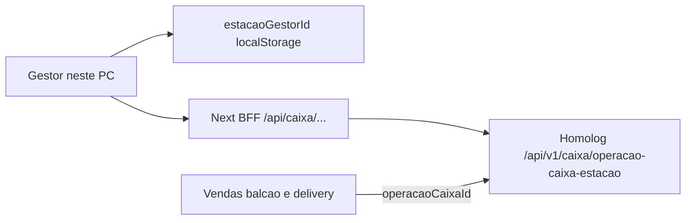

# Caixa do Gestor (delivery e balcão)

Este worktree (`JIFFY-GESTOR-CAIXA`) é exclusivo desta feature. O Hub continua em `JIFFY-GESTOR-OFICIAL` na branch `developer`.

- Pasta: `D:\DESENVOLVIMENTO\Jiffy\JIFFY-GESTOR-CAIXA`
- Branch: `feat/caixa-gestor` (limpa, a partir de `origin/developer`)
- Dev server: porta **5552** (`http://localhost:5552`)
- API homologação: `https://jiffy-backend-hom.nexsyn.com.br`

## O que já sabemos (estudo OpenAPI de homologação)

Base: `https://jiffy-backend-hom.nexsyn.com.br/api/v1` (`NEXT_PUBLIC_EXTERNAL_API_BASE_URL` em [`.env.example`](../../.env.example)). Spec: `/docs/json`.

O backend tem **duas famílias de caixa**. Não misturar.

- **Terminal PDV** — `/caixa/operacao-caixa-terminal/*`
  Já tem histórico no Gestor: [`/historico-fechamento`](../../app/(erp)/historico-fechamento/page.tsx) → BFF [`app/api/caixa/operacao-caixa-terminal`](../../app/api/caixa/operacao-caixa-terminal/route.ts). Fora do escopo desta feature.
- **Estação do Gestor** — `/caixa/operacao-caixa-estacao/*`
  “Lista somente operações vinculadas a estação. Não inclui caixas de terminal PDV.”
  Este é o caixa de **delivery + balcão** feitos no Gestor. **Ainda sem BFF, use cases ou UI real.**

A chave da operação é o `estacaoGestorId` da estação deste computador — o mesmo id já persistido em [`estacaoImpressaoStorage.ts`](../../src/infrastructure/printing/estacaoImpressaoStorage.ts) (`gestor-estacao-impressao-id`) e criado via [`/api/v1/gestor/estacoes-impressao`](../../app/api/gestor/estacoes-impressao/route.ts). Um caixa aberto por estação cobre **os dois canais**; não há caixa separado “delivery” vs “balcão”.

Endpoints da estação (todos exigem JWT da empresa):

- `GET /caixa/operacao-caixa-estacao` — lista/histórico (filtros: `limit`, `offset`, `q`, `dataAberturaInicio`, `dataAberturaFim`, `estacaoGestorId`, `status`)
- `GET /caixa/operacao-caixa-estacao/current/{estacaoGestorId}` — operação **aberta**. **Não abre caixa.** Sem operação: **404**. Query `tipoRetorno=resumido|detalhado`
- `GET /caixa/operacao-caixa-estacao/{id}` — detalhe; 404 se for caixa de terminal ou outra empresa
- `POST .../current/{estacaoGestorId}/fechamento` — body só `{ valorFornecido }`. Responsável = ator do usuário autenticado
- `GET|POST .../current/{estacaoGestorId}/sangrias` e `.../suprimentos`
  POST body `{ valor, descricao }` (`descricao` min 5). **POST abre a operação se ainda não houver uma aberta.**

Não existe `POST` de “abrir caixa”. Abertura é implícita (movimentação e, hipoteticamente, venda).

Vendas já devolvem `operacaoCaixaId`:

- [`CreateVendaGestorRequest`](../../src/application/mappers/CriarVendaPayloadMapper.ts) no OpenAPI exige `estacaoId` — o mapper atual **não envia**
- `CreatePedidoDeliveryGestorRequest` **não tem** `estacaoId` no spec; o vínculo com o caixa precisa ser confirmado no estudo ao vivo

[`MeuCaixaView.tsx`](../../src/presentation/components/features/meu-caixa/MeuCaixaView.tsx) é shell Flutter com mock/TODO (sangria, suprimento, fechar). Entidades [`Caixa.ts`](../../src/domain/entities/Caixa.ts) / [`OperacaoCaixa.ts`](../../src/domain/entities/OperacaoCaixa.ts) estão desalinhadas (`Aberto` vs `aberto`, sem ator/estação/resumos). **Meu Caixa não aparece no TopNav** — só no Sidebar legado.

## Fase 0 — Branch limpa (feita)

Worktree criado sem levar o WIP do Hub:

- `git worktree add -b feat/caixa-gestor D:\DESENVOLVIMENTO\Jiffy\JIFFY-GESTOR-CAIXA origin/developer`
- `.env.local` copiado; `PORT=5552`

## Fase 1 — Estudo autenticado (obrigatório antes de UI)

Sem esta fase não implementar telas. Usar token tenant (login no Gestor apontando para homolog) e a estação já gravada no browser.

Checklist mínimo, com evidência de request/response:

1. `GET current/{estacao}` sem caixa aberto → 404 e mensagem
2. `POST suprimento` (fundo de troco) → cria operação; `GET current` passa a 200
3. `POST sangria` com `descricao` menor que 5, valor 0, caixa já fechado → erros reais
4. Criar venda **balcão** com e sem `estacaoId` → se `operacaoCaixaId` nasce; se o create falha sem `estacaoId`
5. Criar pedido **delivery** (Kanban) e um pedido **público** (cardápio) → se entram no mesmo caixa da estação ou em outro
6. `GET current?tipoRetorno=detalhado` → conferir `resumoPagamentos`, `resumoCaixa`, `resumoOperacao`, produtos
7. `POST fechamento` com `valorFornecido` diferente de `valorLiquidoDinheiroCaixa` → diferença gravada
8. `GET` lista + `GET {id}` após fechar
9. Estação de outra empresa / id de terminal no path de estação → 404
10. Dois browsers (duas estações) da mesma empresa → caixas independentes

Registrar o resultado em [`docs/features/caixa-gestor-estudo-api.md`](caixa-gestor-estudo-api.md) (contratos reais, códigos de erro, quando a venda abre caixa, e se delivery precisa de `estacaoId`/header). **Se o estudo contradizer o OpenAPI, o estudo vence.**

## Fase 2 — Telas e regras (alvo, sujeito ao estudo)

Navegação em [`TopNav.tsx`](../../src/presentation/components/layouts/TopNav.tsx), grupo Vendas: **Meu Caixa** → `/meu-caixa`. Manter **Hist. Fechamentos** como PDV.

| Tela | Rota | Papel |
|------|------|--------|
| Meu Caixa (operação atual) | `/meu-caixa` | Estado aberto/fechado da estação deste PC |
| Sem estação | mesmo | Pedir cadastro/vínculo da estação (fluxo já usado na impressão) |
| Sem caixa aberto | mesmo | CTA “Abrir caixa” = primeiro suprimento (fundo); não inventar endpoint |
| Sangria / Suprimento | modais | `valor` + `descricao` (mínimo 5); responsável = usuário logado |
| Fechar caixa | modal | Mostrar esperado (`valorLiquidoDinheiroCaixa`); informar `valorFornecido`; exibir diferença |
| Histórico da estação | `/meu-caixa/fechamentos` | Lista `GET /operacao-caixa-estacao` |
| Cupom de fechamento | modal/página | Reusar o padrão de [`DetalhesFechamento.tsx`](../../src/presentation/components/features/operacao-caixa/DetalhesFechamento.tsx) com DTO de estação (`abertoPorAtor`, `estacao`) |

Regras de produto:

- Delivery e balcão do **mesmo PC** entram no **mesmo** caixa da estação
- Pedidos PDV (`venda` / terminal) **não** entram neste caixa
- `GET current` 404 = fechado; não tratar como erro fatal
- Fechar só com caixa aberto; sangria/suprimento só com estação válida
- Após fechar, nova venda/suprimento abre **nova** operação (confirmar no estudo)
- Sem `estacaoId` no create de balcão, o caixa da estação fica vazio — o estudo define se o mapper precisa passar a enviar `getEstacaoImpressaoId()`

## Fase 3 — Implementação (só depois do estudo)

Seguir BFF → use case → hook, como o restante do ERP.

- BFF em `app/api/caixa/operacao-caixa-estacao/` espelhando os 6 recursos (list, current, by id, fechamento, sangrias, suprimentos). Mesmo padrão de [`operacao-caixa-terminal/route.ts`](../../app/api/caixa/operacao-caixa-terminal/route.ts): `validateRequest` + `ApiClient`.
- Domain/application novos (não forçar as entidades mockadas): tipos alinhados ao DTO (`status: aberto|fechado`, ator, estação, resumos). Use cases: buscar atual, listar, sangria, suprimento, fechar.
- Presentation: reescrever `MeuCaixaView` contra a API; hooks `useCaixaEstacaoAtual`, `useMovimentacoesCaixaEstacao`, `useFecharCaixaEstacao`; React Query com `useTenantQueryKey`.
- Se o estudo confirmar: enviar `estacaoId` em [`buildCriarVendaGestorPayload`](../../src/application/mappers/CriarVendaPayloadMapper.ts). Delivery só se a API exigir.
- Testes unitários de mapper/regras (404 = fechado, diferença de fechamento, validação de descrição). Sem testes E2E nesta fatia.

Fora de escopo: sangria/fechamento de terminal PDV pelo Gestor; caixa por canal; permissão `encerrarCaixa` de perfil PDV (é do app PDV).
