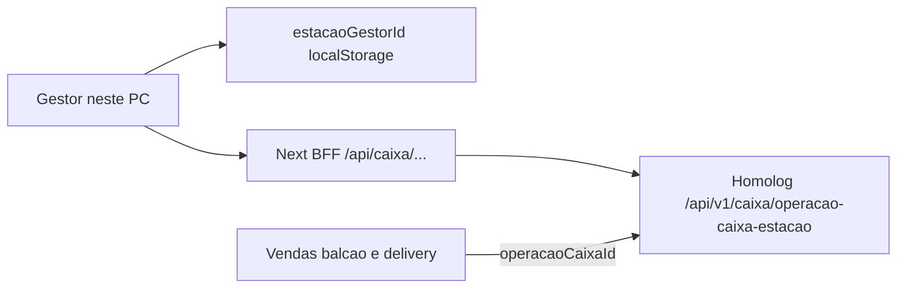

# Caixa do Gestor (delivery e balcão)

Este worktree (`JIFFY-GESTOR-CAIXA`) é exclusivo desta feature. O Hub continua em `JIFFY-GESTOR-OFICIAL` na branch `developer`.

- Pasta: `D:\DESENVOLVIMENTO\Jiffy\JIFFY-GESTOR-CAIXA`
- Branch: `feat/caixa-gestor-clean`
- Dev server: porta **5552** (`http://localhost:5552`)
- API homologação: `https://jiffy-backend-hom.nexsyn.com.br`

## Duas famílias de caixa (não misturar)

- **Terminal PDV** — `/caixa/operacao-caixa-terminal/*`
  Histórico no Gestor: [`/historico-fechamento`](../../app/(erp)/historico-fechamento/page.tsx). **Fora do escopo Meu Caixa.**
- **Estação do Gestor** — `/caixa/operacao-caixa-estacao/*`
  Caixa de **delivery + balcão** deste PC. BFF, use cases e UI implementados.

A chave é o `estacaoGestorId` — mesmo id de `gestor-estacao-impressao-id` no localStorage ([`estacaoImpressaoStorage.ts`](../../src/infrastructure/printing/estacaoImpressaoStorage.ts)). Um caixa aberto por estação cobre **os dois canais**.

## Entrada na UI

**Meu Caixa = somente modal lateral** no Kanban/Fredy. Não existe página `/meu-caixa` nem item no TopNav.

| Componente | Caminho |
|------------|---------|
| Botão toolbar | [`KanbanToolbar.tsx`](../../src/presentation/components/features/kanban/components/KanbanToolbar.tsx) |
| Painel lateral | [`MeuCaixaSidePanel.tsx`](../../src/presentation/components/features/meu-caixa/MeuCaixaSidePanel.tsx) |
| Conteúdo operação | [`MeuCaixaView.tsx`](../../src/presentation/components/features/meu-caixa/MeuCaixaView.tsx) |
| Histórico fechamentos | Aba "Caixas recentes" no mesmo painel ([`FechamentosList.tsx`](../../src/presentation/components/features/meu-caixa/FechamentosList.tsx)) |

## Regras de produto

- Abertura **implícita** via primeiro suprimento (`DESCRICAO_FUNDO_TROCO` = "Fundo de troco") — **não inventar POST de abrir caixa**
- Sangria, suprimento, fechamento via BFF
- `GET current` **404 = caixa fechado** (não é erro fatal)
- Delivery e balcão do **mesmo PC** entram no **mesmo** caixa da estação
- Pedidos PDV (terminal) **não** entram neste caixa
- Venda balcão envia `estacaoId` via [`useNovoPedidoOrchestrator`](../../src/presentation/components/features/pedidos/hooks/useNovoPedidoOrchestrator.ts)

## Arquitetura implementada

### BFF (`app/api/caixa/operacao-caixa-estacao/`)

| Rota BFF | Use case |
|----------|----------|
| `GET /` | `ListarHistoricoCaixaEstacaoUseCase` |
| `GET /current/[estacaoGestorId]` | `BuscarCaixaEstacaoAtualUseCase` |
| `GET /[id]` | `BuscarOperacaoCaixaEstacaoPorIdUseCase` |
| `POST .../suprimentos` | `RegistrarSuprimentoCaixaEstacaoUseCase` |
| `POST .../sangrias` | `RegistrarSangriaCaixaEstacaoUseCase` |
| `POST .../fechamento` | `FecharCaixaEstacaoUseCase` |

Proxy: [`caixaEstacaoBff.ts`](../../src/infrastructure/api/caixaEstacaoBff.ts)

### Application / Domain

- DTOs: `src/application/dto/caixa-estacao/OperacaoCaixaEstacaoDTO.ts`
- Use cases: `src/application/use-cases/caixa-estacao/`
- Port: `src/application/ports/IOperacaoCaixaEstacaoGateway.ts`
- Repository: `src/infrastructure/api/repositories/OperacaoCaixaEstacaoApiRepository.ts`
- Entidade: `src/domain/entities/OperacaoCaixaEstacao.ts`
- Regras: `src/domain/caixa-estacao/regrasCaixaEstacao.ts`
- Constante compartilhada: `src/shared/constants/caixaEstacao.ts` (`DESCRICAO_MOVIMENTACAO_MIN`)
- Validators Zod: `src/application/validators/caixa-estacao/`
- Validação HTTP BFF: `src/infrastructure/api/caixaEstacaoRouteValidation.ts`

### Presentation (hooks)

Hooks em `src/presentation/components/features/meu-caixa/hooks/`:

- `useCaixaEstacaoAtual.ts`
- `useMovimentacoesCaixaEstacao.ts`
- `useFecharCaixaEstacao.ts` (inclui `useHistoricoCaixaEstacao`)
- `useOperacaoCaixaEstacaoPorId.ts`
- `caixaEstacaoCache.ts` (invalidação + updates otimistas)

Estação deste PC: `src/presentation/hooks/useEstacaoDestePc.ts`

### Cache / invalidação

Invalidação do caixa atual após:

- Abrir painel Meu Caixa
- Finalizar pedido delivery (Kanban, WhatsApp)
- Criar venda balcão
- Fechar caixa / movimentações (via React Query onSettled)

## Testes

- `tests/unit/domain/caixa-estacao/regrasCaixaEstacao.test.ts`
- `tests/unit/domain/caixa-estacao/estacaoReceptoraDelivery.test.ts`
- `tests/unit/domain/entities/OperacaoCaixaEstacao.test.ts`
- `tests/unit/application/validators/caixaEstacaoInputSchemas.test.ts`
- `tests/unit/application/caixa-estacao/mapOperacaoCaixaEstacaoToPrintDocument.test.ts`

## Fora de escopo

- Sangria/fechamento de terminal PDV pelo Gestor
- Caixa separado por canal (delivery vs balcão)
- Permissão `encerrarCaixa` de perfil PDV (app PDV)
- Endpoints `/caixa/operacao-caixa-terminal` no Meu Caixa
