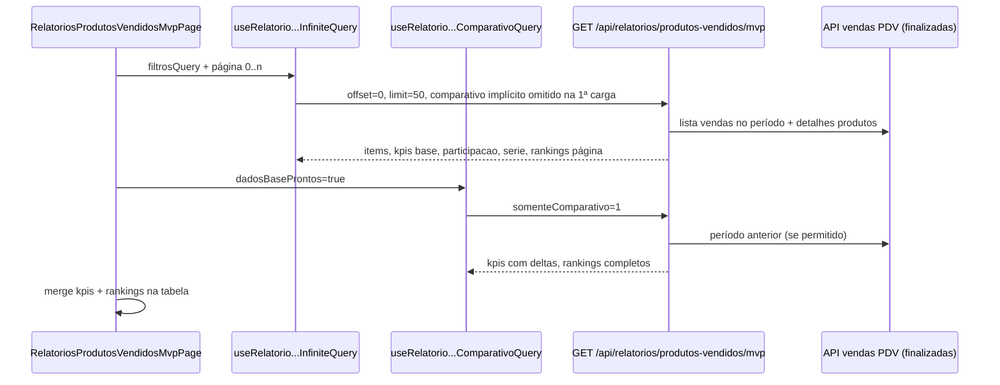

# Relatório Produtos Vendidos (MVP)

> **Documento vivo** — mapeia a página atual, endpoints, contratos e o que já é exibido na UI. Atualize ao mudar filtros, BFF ou componentes.

**Última revisão:** 2026-05-18  
**Rota pública:** `/relatorios-produtos-vendidos` (redirect de `/relatorios-produtos-vendidos-mvp` em `next.config.js`)  
**Página:** `src/presentation/components/features/relatorios-produtos-vendidos-mvp/RelatoriosProdutosVendidosMvpPage.tsx`

**Fonte de dados (hoje):** vendas **PDV finalizadas** agregadas no **BFF Next.js** (`app/api/relatorios/produtos-vendidos/mvp/route.ts`), reutilizando pipeline em `src/infrastructure/relatorios/`. Não consome diretamente `GET /api/v1/relatorios/top-produtos` do backend Nest (contrato futuro documentado em `relatoriosProdutosVendidosApi.ts`).

---

## Índice

1. [Visão geral da tela](#1-visão-geral-da-tela)
2. [Fluxo de dados (diagrama)](#2-fluxo-de-dados-diagrama)
3. [Endpoint único e modos de chamada](#3-endpoint-único-e-modos-de-chamada)
4. [Query params (filtros → API)](#4-query-params-filtros--api)
5. [Contratos TypeScript (resposta)](#5-contratos-typescript-resposta)
6. [Estado e hooks na página](#6-estado-e-hooks-na-página)
7. [Filtros na UI](#7-filtros-na-ui)
8. [O que já é exibido](#8-o-que-já-é-exibido)
9. [Campos na API que ainda não aparecem na UI](#9-campos-na-api-que-ainda-não-aparecem-na-ui)
10. [BFF: pipeline, cache e comparativo](#10-bff-pipeline-cache-e-comparativo)
11. [Arquivos do feature folder](#11-arquivos-do-feature-folder)
12. [Changelog deste documento](#12-changelog-deste-documento)

---

## 1. Visão geral da tela

Layout vertical:

```
┌─────────────────────────────────────────────────────────┐
│ Título + subtítulo (PDV finalizadas)                    │
├─────────────────────────────────────────────────────────┤
│ MvpFiltersBar (sempre visível)                          │
├─────────────────────────────────────────────────────────┤
│ [Loading central] OU [Erro] OU:                         │
│   • MvpKpiGrid (scroll horizontal)                      │
│   • MvpChartParticipacao | MvpChartEvolucao (grid xl)   │
│   • MvpProdutosTable (scroll infinito)                  │
└─────────────────────────────────────────────────────────┘
```

**Subtítulo fixo:** *"KPIs, participação por grupo e tendência dos principais produtos — dados das vendas PDV finalizadas."*

**Timezone:** `useEmpresaMe().timezoneAgregacao` (fallback `America/Sao_Paulo`) — usado em períodos e série diária.

---

## 2. Fluxo de dados (diagrama)



---

## 3. Endpoint único e modos de chamada

| Método | URL | Auth |
|--------|-----|------|
| `GET` | `/api/relatorios/produtos-vendidos/mvp` | `Authorization: Bearer` + `empresaId` no token |

### 3.1 Carga principal (infinite query)

- **Hook:** `useRelatorioProdutosVendidosMvpInfiniteQuery`
- **Página:** 50 itens (`RELATORIO_MVP_LIST_PAGE_SIZE`)
- **1ª página (`offset=0`):** resposta completa — KPIs, `participacaoGrupos`, `serieTemporal`, `items`, `rankingsPorProduto` (só IDs da página)
- **Páginas seguintes (`offset>0`):** query `somentePagina=1` → corpo leve: `items` + KPIs + rankings da página; **sem** gráficos de novo

### 3.2 Comparativo (2ª fase)

- **Hook:** `useRelatorioProdutosVendidosMvpComparativoQuery`
- **Query:** `somenteComparativo=1`
- **Quando:** `dadosBaseProntos === true` (1ª página carregada e comparativo não omitido)
- **Retorno:** `{ somenteComparativo: true, kpis, rankingsPorProduto, mockFlags }`

### 3.3 Flags de query especiais (BFF)

| Param | Efeito |
|-------|--------|
| `comparativo=0` | Enviado na 1ª página pelo hook (`incluirComparativo: false`) — não busca período anterior na mesma request |
| `somenteComparativo=1` | Só KPIs + rankings comparativos |
| `somentePagina=1` | Paginação leve (`offset > 0`) |
| `serie=0` | Omite série temporal (default: inclui) |
| `mock=1` | Margem bruta mock nas linhas |

---

## 4. Query params (filtros → API)

Montados em `useRelatorioProdutosVendidosMvpQuery.appendFiltrosRelatorioMvp`:

| Param UI / estado | Query string | Observação |
|-------------------|--------------|------------|
| `filtroPeriodo` → `filtroRelatorioParaApiPeriodo` | `periodo` | `hoje`, `ontem`, `semana`, `30dias`, `mes`, `60dias`, `90dias`, `todos`, `personalizado` |
| Datas personalizadas | `dataFinalizacaoInicial`, `dataFinalizacaoFinal` | ISO UTC; UI usa `assumirDateComoNoFusoEmpresaParaUtc` |
| — | `timezone` | Fuso da empresa |
| `sort` | `sort` | `quantidade_desc` \| `quantidade_asc` \| `valor_desc` \| `valor_asc` |
| `grupoId` | `grupoIds` | CSV (um id hoje) |
| `valorMin` / `valorMax` | `valorMin` / `valorMax` | Número opcional |
| `qtdMin` / `qtdMax` | `qtdMin` / `qtdMax` | Número opcional |
| `buscaNome` | `q` | Busca no nome do produto |
| Paginação | `limit`, `offset` | Default BFF: 50, max 200 |

**Período no BFF:** `montarParamsVendasPdvPeriodo` → filtra vendas PDV por **data de finalização** (mesma regra do dashboard).

---

## 5. Contratos TypeScript (resposta)

### 5.1 Base — `RelatorioProdutosVendidosResponseDTO`

(`src/shared/types/relatoriosProdutosVendidosApi.ts`)

| Campo | Tipo | Uso na página |
|-------|------|----------------|
| `items[]` | `RelatorioProdutoVendidoLinhaDTO` | Tabela |
| `totaisPeriodo` | `{ quantidadeTotal, valorTotal, skusDistintos }` | **Não exibido** |
| `totalFiltrado` | `number` | Rodapé da tabela |
| `limit`, `offset` | `number` | Paginação |
| `mockAtivo` | `boolean` | BFF |

**Linha `RelatorioProdutoVendidoLinhaDTO`:**

| Campo | Exibido na tabela? |
|-------|-------------------|
| `produtoId` | key |
| `nome` | Sim |
| `grupoId`, `grupoNome` | Grupo (lg+) |
| `quantidade` | Sim |
| `valorTotal` | Faturamento |
| `precoMedioVenda` | Preço médio |
| `classeAbc` | Badge A/B/C |
| `percentualFaturamento`, `percentualUnidades` | **Não** |
| `valorCardapio`, `deltaPrecoVsCardapioPercentual` | **Não** |
| `margemBrutaPercentual` | **Não** (mock no BFF se `mock=1`) |

### 5.2 MVP — extras em `RelatorioProdutosVendidosMvpResponseDTO`

(`src/shared/types/relatoriosProdutosVendidosMvpApi.ts`)

**`kpis` — `RelatorioProdutosVendidosMvpKpisDTO`:**

| Campo | KPI card |
|-------|----------|
| `faturamentoAtual` | Faturamento período |
| `faturamentoAnterior`, `variacaoPercentualFat` | Badge + rodapé |
| `quantidadeVendidaAtual` | Unidades vendidas |
| `quantidadeAnterior`, `variacaoPercentualQuantidade` | Badge + rodapé |
| `ticketMedioPorItemNoPeriodo` | Ticket médio / unidade |
| `ticketMedioPorItemPeriodoAnterior`, `variacaoPercentualTicketMedio` | Badge + rodapé |
| `produtoLiderNomeQuantidade`, `produtoLiderQuantidadeUnidades` | Líder em quantidade |
| `produtoLiderPercentualVsPeriodoAnterior` | Calculado; badge do líder **comentado** no UI |
| `produtoComMaiorCrescimentoNome`, `produtoComMaiorCrescimentoPct` | Card "Maior crescimento" (se ambos non-null) |

**`participacaoGrupos[]`:**

| Campo | Uso |
|-------|-----|
| `grupoId`, `key`, `nomeGrupo` | Donut + legenda |
| `valorTotal`, `pct` | Valores e % |

**`serieTemporal[]` — por dia:**

| Campo | Uso |
|-------|-----|
| `dia` | `YYYY-MM-DD` (fuso empresa) |
| `valores[]` | `{ produtoId, valor, nome? }` |
| `totalDia` | Soma do dia |

**`rankingsPorProduto[]`:**

| Campo | Uso na tabela |
|-------|----------------|
| `variacaoValorPct` | Coluna "% Faturamento" |
| `variacaoQtdPct` | Coluna "% Qtd" |
| `liderValorNoPeriodo`, `maiorCrescimentoQtdPct` | Lógica BFF; **não** badge na tabela |
| `nome`, `liderNomeNoPeriodo` | Metadados |

**`mockFlags`:**

| Flag | Efeito UI |
|------|-----------|
| `serieSimplificada` | Aviso no gráfico de evolução |
| `comparativoPeriodoAnteriorOmitido` | Desliga query comparativa; KPIs sem período anterior |

---

## 6. Estado e hooks na página

### 6.1 Duplo estado de filtros

| State | Papel |
|-------|--------|
| `filtros` | Rascunho no formulário |
| `filtrosQuery` | Valores que disparam React Query |

**Aplicação imediata** (`handleFiltrosFieldChange`) ao mudar:

- `filtroPeriodo`, datas personalizadas, `sort`, `grupoId`

**Exigem botão "Aplicar"** (`onAplicar` → `setFiltrosQuery(filtros)`):

- `buscaNome`, `valorMin`, `valorMax`, `qtdMin`, `qtdMax`

### 6.2 Queries

```ts
useRelatorioProdutosVendidosMvpInfiniteQuery({ periodo, periodoInicial/Final, timezone, sort, grupoIds, ... })
useRelatorioProdutosVendidosMvpComparativoQuery({ ...mesmos filtros, dadosBaseProntos })
useGruposProdutos({ limit: 500, ativo: true })  // dropdown grupo
useEmpresaMe()  // timezone
```

### 6.3 Derivações na página

| Variável | Origem |
|----------|--------|
| `kpisExibicao` | `comparativoData.kpis` ?? `firstPage.kpis` |
| `mockFlagsExibicao` | comparativo ?? firstPage |
| `listItems` | `flatMap` pages → `items` |
| `rankingsPorProduto` | comparativo completo ou merge por `produtoId` das páginas |
| `conteudoPrincipalCarregando` | `isLoading` ou refetch com placeholder sem 1ª página |
| `kpisComparativoPendente` | 1ª página ok, comparativo fetching, sem dados ainda |

### 6.4 Loading / erro

- **Um** `JiffyLoading` central cobre KPIs + gráficos + tabela até a 1ª página estável.
- Scroll infinito: loading **só** no rodapé da tabela (`isFetchingNextPage`).
- Erro: banner vermelho com `error.message`.

---

## 7. Filtros na UI

**Componente:** `MvpFiltersBar`

| Controle | Campo `filtros` | Aplicação |
|----------|-----------------|-----------|
| Busca nome | `buscaNome` | Aplicar / Enter |
| Valor mín/máx R$ | `valorMin`, `valorMax` | Aplicar / Enter |
| Período (select) | `filtroPeriodo` | Imediata |
| Por datas (modal) | `periodoPersonalizadoInicio/Fim` | Imediata ao confirmar |
| Ordenação | `sort` | Imediata |
| Grupo | `grupoId` | Imediata |
| Qtd mín/máx | `qtdMin`, `qtdMax` | Aplicar / Enter |
| Limpar | reset `defaultFiltros` | Ambos states |
| Aplicar | copia `filtros` → `filtrosQuery` | — |

**Default:** período `hoje`, sort `quantidade_desc`, demais vazios.

**Mobile:** toggle "Mostrar/Ocultar filtros".

**Grupos:** `GET` via hook `useGruposProdutos` (não passa pelo BFF do relatório).

---

## 8. O que já é exibido

### 8.1 KPIs (`MvpKpiGrid`)

Até **5 cards** em faixa horizontal:

1. Faturamento período (+ % vs anterior)
2. Unidades vendidas (+ %)
3. Ticket médio / unidade (+ %)
4. Líder em quantidade (nome + unidades no período)
5. Maior crescimento (nome + % vs anterior), se existir

Enquanto comparativo carrega: badges `…` e rodapé "Atualizando período anterior…".

### 8.2 Gráfico participação (`MvpChartParticipacao`)

- Donut Recharts — top **10** grupos por `valorTotal` no conjunto filtrado.
- Legenda com nome e % (`pct`).
- Estado vazio: borda tracejada com mensagem.

### 8.3 Gráfico evolução (`MvpChartEvolucao`)

- Line chart — até **10** produtos (top por valor no período filtrado).
- Eixo X: dias (`formatarDiaDm`).
- Eixo Y: valores em R$.
- Tooltip customizado por dia.
- Se `mockFlags.serieSimplificada`: mensagem de série simplificada (fallback quando não há detalhe diário por venda).

### 8.4 Tabela (`MvpProdutosTable`)

| Coluna | Dado |
|--------|------|
| # | índice 1-based |
| ABC | `classeAbc` |
| Produto | `nome` |
| Grupo | `grupoNome` (hidden &lt; lg) |
| Qtd | `quantidade` |
| % Qtd | `ranking.variacaoQtdPct` (cores verde/vermelho) |
| % Faturamento | `ranking.variacaoValorPct` |
| Faturamento | `valorTotal` |
| Preço médio | `precoMedioVenda` |

Rodapé: `Exibindo N de totalFiltrado` + hint scroll. Infinite scroll ~400px do fim.

---

## 9. Campos na API que ainda não aparecem na UI

Úteis para próximas modificações:

- `totaisPeriodo` (totais do período PDV inteiro vs filtrado)
- `percentualFaturamento` / `percentualUnidades` por linha (curva ABC já tem classe)
- `valorCardapio`, `deltaPrecoVsCardapioPercentual`
- `margemBrutaPercentual`
- Flags `liderValorNoPeriodo`, `maiorCrescimentoQtdPct` na linha
- `mockAtivo` / indicador visual de dados mock
- Card KPI `produtoLiderPercentualVsPeriodoAnterior` (código preparado, badge comentado)
- Opção `serie=0` não exposta na UI

---

## 10. BFF: pipeline, cache e comparativo

**Pipeline:** `executarRelatorioProdutosVendidosPipeline` em `montarRelatorioProdutosVendidos.ts`

1. Busca IDs de vendas PDV **finalizadas** no intervalo (`agregarVendasPorProdutoPdv.ts`).
2. Carrega detalhes / produtos lançados por venda.
3. Agrega por `produtoId`, aplica filtros (grupo, valor, qtd, busca).
4. Ordena (`sort`), pagina, calcula ABC e % internos.
5. MVP: participação por grupo, série diária (top produtos), rankings vs período anterior.

**Cache:** `relatorioProdutosVendidosAgregadoCache` ~90s por `empresaId` + chave de filtros.

**Comparativo período anterior:**

- Intervalo deslizante: `periodoRelatorioSlidingAnterior` (mesma duração imediatamente antes).
- **Omitido** se: sem intervalo definido, período &gt; **95 dias**, ou faturamento atual ≤ 0.
- 2ª request preenche `anterior` e recalcula KPIs + `rankingsPorProduto` completos.

**Série temporal:** `computarSerieDiariaValorProdutosFiltrados` — top N produtos por valor no filtro; nomes do mini cardápio quando disponível.

---

## 11. Arquivos do feature folder

```
relatorios-produtos-vendidos-mvp/
├── RelatoriosProdutosVendidosMvpPage.tsx    # Orquestrador
├── relatoriosProdutosVendidosFilters.ts     # Tipos período + map API
├── mvpFiltrosVendasSx.ts                    # sx MUI filtros (estilo VendasList)
├── components/
│   ├── MvpFiltersBar.tsx
│   ├── MvpPorDatasModal.tsx
│   ├── MvpKpiGrid.tsx
│   ├── MvpChartParticipacao.tsx
│   ├── MvpChartEvolucao.tsx
│   ├── MvpProdutosTable.tsx
│   └── MvpHeader.tsx                          # (existe; não usado na page atual)
└── utils/
    ├── mvpFormatPt.ts                         # moeda, %, variação
    └── mvpFormatDataHora.ts                   # datas filtro
```

**Hooks externos:**

- `src/presentation/hooks/useRelatorioProdutosVendidosMvpQuery.ts`
- `src/presentation/hooks/useGruposProdutos.ts`
- `src/presentation/hooks/useEmpresaMe.ts`

**Infra BFF:**

- `app/api/relatorios/produtos-vendidos/mvp/route.ts`
- `src/infrastructure/relatorios/*`
- `src/infrastructure/dashboard/agregarVendasPorProdutoPdv.ts`

**Navegação:** `Sidebar` / `TopNav` → `/relatorios-produtos-vendidos`; `DashboardTopProdutos` link para o relatório.

---

## 12. Changelog deste documento

| Data | Alteração |
|------|-----------|
| 2026-05-18 | Documento inicial: fluxo, endpoint, contratos, UI vs API, BFF |

---

### Como manter

1. Novo filtro ou param → §4, §7 e hook `appendFiltrosRelatorioMvp`.
2. Novo KPI/gráfico/coluna → §5 e §8.
3. Migração para API Nest `top-produtos` → §1 e `relatoriosProdutosVendidosApi.ts` (comentário existente).
4. Registrar em §12.
